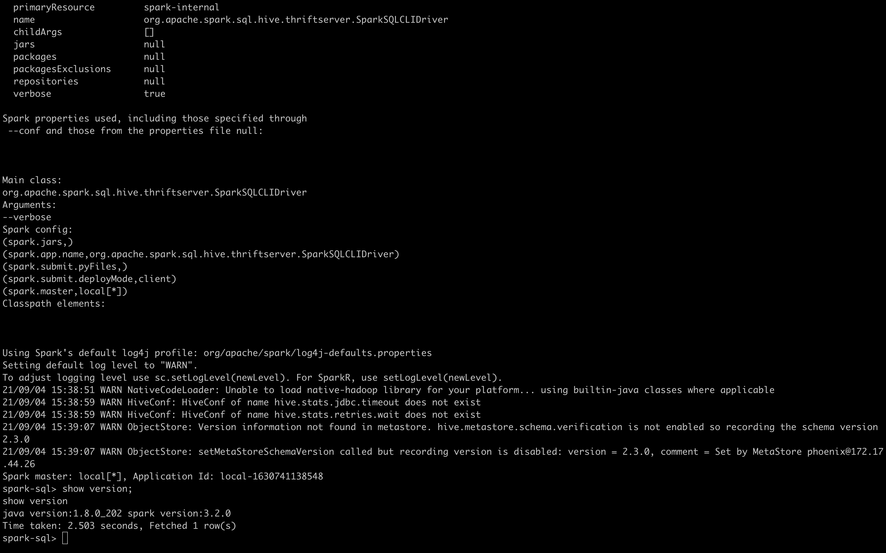

# 第一题
结果如图


# 第二题
## 优化规则解释
### CombineFilters
官方解释：
> Combines two adjacent [[Filter]] operators into one, merging the non-redundant conditions into one conjunctive predicate.

CombineFilters属于普通的逻辑树优化器会该表树结构，简单讲就是合并filter操作，条件是这两个filter是不关注顺序切实切实确定的（deterministic = true），属于算子合并。比如：
> select * from (select name,age from student where age>10) where age < 20

### CollapseProject
官方解释
>  Combines two [[Project]] operators into one and perform alias substitution, merging the expressions into one single expression for the following cases.
>  1. When two [[Project]] operators are adjacent.
>  2. When two [[Project]] operators have LocalLimit/Sample/Repartition operator between them 
      and the upper project consists of the same number of columns which is equal or aliasing.`GlobalLimit(LocalLimit)` pattern is also considered.

CollapseProject属于普通的逻辑树优化器会该表树结构，合并project，需要这2个project是相邻的，2个project操作之间有LocalLimit/Sample/Repartition且列是相同的。比如：
> select name from ( select name,age from student)

### BooleanSimplification
官方解释：
> Simplifies boolean expressions:
> 1. Simplifies expressions whose answer can be determined without evaluating both sides.
> 2. Eliminates / extracts common factors.
> 3. Merge same expressions
> 4. Removes `Not` operator.

BooleanSimplification，属于Expression优化器（表达式优化器）在expressions.scala中，这种优化器不影响逻辑计划结构。布尔逻辑表达式的优化

### ConstantFolding
官方解释
> Replaces [[Expression Expressions]] that can be statically evaluated with equivalent [[Literal]] values.

将表达式（Expression）替换成静态的文字值（Literal），比如：

> select name, (60-1) as score where age > 35 from student

### PushDownPredicates(谓词下推，重要)
官方解释
> The unified version for predicate pushdown of normal operators and joins. 
> This rule improves performance of predicate pushdown for cascading joins such as:Filter-Join-Join-Join. 
> Most predicates can be pushed down in a single pass.

谓词可理解为过滤条件，谓词下推就是将数据筛选尽量下移到取数的时候。PushDownPredicates是谓词下推的入口，具体分为带Join的谓词下推和不带Join的谓词下推。比如

> select * from (select * fro test) where visit_accumul = 264

### ReplaceDistinctWithAggregate
官方解释
> Replaces logical [[Distinct]] operator with an [[Aggregate]] operator.

将distinct去重操作变为aggregate聚合操作，比如
> SELECT DISTINCT f1, f2 FROM t  ==>  SELECT f1, f2 FROM t GROUP BY f1, f2

### ReplaceExceptWithAntiJoin
官方解释
> Replaces logical [[Except]] operator with a left-anti [[Join]] operator.
> note:
> 1. This rule is only applicable to EXCEPT DISTINCT. Do not use it for EXCEPT ALL.
> 2. This rule has to be done after de-duplicating the attributes; otherwise, the generated join conditions will be incorrect.

替换将逻辑排除操作（except）改为left-anti Join操作，;注意本规则值应用于`EXCEPT DISTINCT`,本规则必须在数据去重操作后执行，否则生成的join条件将不正确
>  SELECT a1, a2 FROM Tab1 EXCEPT SELECT b1, b2 FROM Tab2  ==>  SELECT DISTINCT a1, a2 FROM Tab1 LEFT ANTI JOIN Tab2 ON a1<=>b1 AND a2<=>b2

### FoldablePropagation
官方解释
> Replace attributes with aliases of the original foldable expressions if possible.
> Other optimizations will take advantage of the propagated foldable expressions. For example, this rule can optimize
>> SELECT 1.0 x, 'abc' y, Now() z ORDER BY x, y, 3 ==> SELECT 1.0 x, 'abc' y, Now() z ORDER BY 1.0, 'abc', Now()
> 
>  and other rules can further optimize it and remove the ORDER BY operator.

用原生表达式(expression)代表属性别名，这样做方便其他表达式做进一步优化，比如删除order by 操作。

## 解答
### 准备
> set spark.sql.planChangeLog.level=WARN;
> create table student (id string, name string, age int, sex string);

### 第一题
答：
> select name from (select id,name,age from student where age > 18 and id <> null ) where age < 35;

根据日志下文的日志，在第一个`Metrics of Executed Rules`之前执行的是Analyzer模块。用于与Catalog进行绑定，生成`Resolved LogicaLPlan`。

该部分根据`org.apache.spark.sql.catalyst.analysis.Analyzer$batches`定义的Batch顺序，执行了239个规则，实际生效6条。

日志后续内容是Optimizer模块，使用261条规则优化逻辑树，其中生效的规则是9条，规则顺序按照`org.apache.spark.sql.execution.SparkOptimizer$defaultBatches`的定义。同时，我们可以发现，所有关注的优化器都在名为"Operator Optimization before Inferring Filters"和"Operator Optimization after Inferring Filters"的Batch中。

由于在谓词下推PushDownPredicates中首先调用了CombineFilters，且PushDownPredicates的顺序高于CombineFilters，因此我们观察是否使用CombineFilters可以等价为是否使用了PushDownPredicates。

```scala
object PushDownPredicates extends Rule[LogicalPlan] with PredicateHelper {
  def apply(plan: LogicalPlan): LogicalPlan = plan.transformWithPruning(
    _.containsAnyPattern(FILTER, JOIN)) {
    CombineFilters.applyLocally // 首先调用CombineFilters
      .orElse(PushPredicateThroughNonJoin.applyLocally)
      .orElse(PushPredicateThroughJoin.applyLocally)
  }
}
```
通过日志我们发现，在PushDownPredicates优化器中，原本2个where条件被合并成了1个，

在CollapseProject中2个对象`Project [name#11]`和`Project [id#10, name#11, age#12]`被合并成`Project [name#11]`

由于`NullPropagation`和`ReplaceNullWithFalseInPredicate`的作用 `id <> null` 被优化成了`false`，在BooleanSimplification的作用下所有where语句被简化成了`false`

日志如下：
```text
spark-sql> select name from (select id,name,age from student where age > 18 and id <> null ) where age < 35;
21/09/05 10:57:41 WARN PlanChangeLogger: Batch Substitution has no effect.
21/09/05 10:57:41 WARN PlanChangeLogger: Batch Disable Hints has no effect.
21/09/05 10:57:41 WARN PlanChangeLogger: Batch Hints has no effect.
21/09/05 10:57:41 WARN PlanChangeLogger: Batch Simple Sanity Check has no effect.
21/09/05 10:57:41 WARN PlanChangeLogger:
=== Applying Rule org.apache.spark.sql.catalyst.analysis.Analyzer$ResolveRelations ===
 'Project ['name]                                          'Project ['name]
 +- 'Filter ('age < 35)                                    +- 'Filter ('age < 35)
    +- 'SubqueryAlias __auto_generated_subquery_name          +- 'SubqueryAlias __auto_generated_subquery_name
       +- 'Project ['id, 'name, 'age]                            +- 'Project ['id, 'name, 'age]
          +- 'Filter (('age > 18) AND NOT ('id = null))             +- 'Filter (('age > 18) AND NOT ('id = null))
!            +- 'UnresolvedRelation [student], [], false               +- 'SubqueryAlias spark_catalog.default.student
!                                                                         +- 'UnresolvedCatalogRelation `default`.`student`, org.apache.hadoop.hive.serde2.lazy.LazySimpleSerDe, [], false

21/09/05 10:57:41 WARN PlanChangeLogger:
=== Applying Rule org.apache.spark.sql.execution.datasources.FindDataSourceTable ===
 'Project ['name]                                                                                                                  'Project ['name]
 +- 'Filter ('age < 35)                                                                                                            +- 'Filter ('age < 35)
    +- 'SubqueryAlias __auto_generated_subquery_name                                                                                  +- 'SubqueryAlias __auto_generated_subquery_name
       +- 'Project ['id, 'name, 'age]                                                                                                    +- 'Project ['id, 'name, 'age]
          +- 'Filter (('age > 18) AND NOT ('id = null))                                                                                     +- 'Filter (('age > 18) AND NOT ('id = null))
!            +- 'SubqueryAlias spark_catalog.default.student                                                                                   +- SubqueryAlias spark_catalog.default.student
!               +- 'UnresolvedCatalogRelation `default`.`student`, org.apache.hadoop.hive.serde2.lazy.LazySimpleSerDe, [], false                  +- HiveTableRelation [`default`.`student`, org.apache.hadoop.hive.serde2.lazy.LazySimpleSerDe, Data Cols: [id#10, name#11, age#12, sex#13], Partition Cols: []]

21/09/05 10:57:41 WARN PlanChangeLogger:
=== Applying Rule org.apache.spark.sql.catalyst.analysis.Analyzer$ResolveReferences ===
 'Project ['name]                                                                                                                                                                 'Project ['name]
 +- 'Filter ('age < 35)                                                                                                                                                           +- 'Filter ('age < 35)
    +- 'SubqueryAlias __auto_generated_subquery_name                                                                                                                                 +- 'SubqueryAlias __auto_generated_subquery_name
       +- 'Project ['id, 'name, 'age]                                                                                                                                                   +- 'Project ['id, 'name, 'age]
!         +- 'Filter (('age > 18) AND NOT ('id = null))                                                                                                                                    +- 'Filter ((age#12 > 18) AND NOT (id#10 = null))
             +- SubqueryAlias spark_catalog.default.student                                                                                                                                   +- SubqueryAlias spark_catalog.default.student
                +- HiveTableRelation [`default`.`student`, org.apache.hadoop.hive.serde2.lazy.LazySimpleSerDe, Data Cols: [id#10, name#11, age#12, sex#13], Partition Cols: []]                  +- HiveTableRelation [`default`.`student`, org.apache.hadoop.hive.serde2.lazy.LazySimpleSerDe, Data Cols: [id#10, name#11, age#12, sex#13], Partition Cols: []]

21/09/05 10:57:41 WARN PlanChangeLogger:
=== Applying Rule org.apache.spark.sql.catalyst.analysis.TypeCoercionBase$CombinedTypeCoercionRule ===
 'Project ['name]                                                                                                                                                                 'Project ['name]
 +- 'Filter ('age < 35)                                                                                                                                                           +- 'Filter ('age < 35)
    +- 'SubqueryAlias __auto_generated_subquery_name                                                                                                                                 +- 'SubqueryAlias __auto_generated_subquery_name
       +- 'Project ['id, 'name, 'age]                                                                                                                                                   +- 'Project ['id, 'name, 'age]
!         +- 'Filter ((age#12 > 18) AND NOT (id#10 = null))                                                                                                                                +- Filter ((age#12 > 18) AND NOT (id#10 = null))
             +- SubqueryAlias spark_catalog.default.student                                                                                                                                   +- SubqueryAlias spark_catalog.default.student
                +- HiveTableRelation [`default`.`student`, org.apache.hadoop.hive.serde2.lazy.LazySimpleSerDe, Data Cols: [id#10, name#11, age#12, sex#13], Partition Cols: []]                  +- HiveTableRelation [`default`.`student`, org.apache.hadoop.hive.serde2.lazy.LazySimpleSerDe, Data Cols: [id#10, name#11, age#12, sex#13], Partition Cols: []]

21/09/05 10:57:41 WARN PlanChangeLogger:
=== Applying Rule org.apache.spark.sql.catalyst.analysis.Analyzer$ResolveReferences ===
!'Project ['name]                                                                                                                                                                 Project [name#11]
!+- 'Filter ('age < 35)                                                                                                                                                           +- Filter (age#12 < 35)
!   +- 'SubqueryAlias __auto_generated_subquery_name                                                                                                                                 +- SubqueryAlias __auto_generated_subquery_name
!      +- 'Project ['id, 'name, 'age]                                                                                                                                                   +- Project [id#10, name#11, age#12]
          +- Filter ((age#12 > 18) AND NOT (id#10 = null))                                                                                                                                 +- Filter ((age#12 > 18) AND NOT (id#10 = null))
             +- SubqueryAlias spark_catalog.default.student                                                                                                                                   +- SubqueryAlias spark_catalog.default.student
                +- HiveTableRelation [`default`.`student`, org.apache.hadoop.hive.serde2.lazy.LazySimpleSerDe, Data Cols: [id#10, name#11, age#12, sex#13], Partition Cols: []]                  +- HiveTableRelation [`default`.`student`, org.apache.hadoop.hive.serde2.lazy.LazySimpleSerDe, Data Cols: [id#10, name#11, age#12, sex#13], Partition Cols: []]

21/09/05 10:57:41 WARN PlanChangeLogger:
=== Result of Batch Resolution ===
!'Project ['name]                                          Project [name#11]
!+- 'Filter ('age < 35)                                    +- Filter (age#12 < 35)
!   +- 'SubqueryAlias __auto_generated_subquery_name          +- SubqueryAlias __auto_generated_subquery_name
!      +- 'Project ['id, 'name, 'age]                            +- Project [id#10, name#11, age#12]
!         +- 'Filter (('age > 18) AND NOT ('id = null))             +- Filter ((age#12 > 18) AND NOT (id#10 = null))
!            +- 'UnresolvedRelation [student], [], false               +- SubqueryAlias spark_catalog.default.student
!                                                                         +- HiveTableRelation [`default`.`student`, org.apache.hadoop.hive.serde2.lazy.LazySimpleSerDe, Data Cols: [id#10, name#11, age#12, sex#13], Partition Cols: []]

21/09/05 10:57:41 WARN PlanChangeLogger: Batch Remove TempResolvedColumn has no effect.
21/09/05 10:57:41 WARN PlanChangeLogger: Batch Apply Char Padding has no effect.
21/09/05 10:57:41 WARN PlanChangeLogger:
=== Applying Rule org.apache.spark.sql.hive.DetermineTableStats ===
 Project [name#11]                                                                                                                                                                Project [name#11]
 +- Filter (age#12 < 35)                                                                                                                                                          +- Filter (age#12 < 35)
    +- SubqueryAlias __auto_generated_subquery_name                                                                                                                                  +- SubqueryAlias __auto_generated_subquery_name
       +- Project [id#10, name#11, age#12]                                                                                                                                              +- Project [id#10, name#11, age#12]
          +- Filter ((age#12 > 18) AND NOT (id#10 = null))                                                                                                                                 +- Filter ((age#12 > 18) AND NOT (id#10 = null))
             +- SubqueryAlias spark_catalog.default.student                                                                                                                                   +- SubqueryAlias spark_catalog.default.student
                +- HiveTableRelation [`default`.`student`, org.apache.hadoop.hive.serde2.lazy.LazySimpleSerDe, Data Cols: [id#10, name#11, age#12, sex#13], Partition Cols: []]                  +- HiveTableRelation [`default`.`student`, org.apache.hadoop.hive.serde2.lazy.LazySimpleSerDe, Data Cols: [id#10, name#11, age#12, sex#13], Partition Cols: []]

21/09/05 10:57:41 WARN PlanChangeLogger:
=== Result of Batch Post-Hoc Resolution ===
 Project [name#11]                                                                                                                                                                Project [name#11]
 +- Filter (age#12 < 35)                                                                                                                                                          +- Filter (age#12 < 35)
    +- SubqueryAlias __auto_generated_subquery_name                                                                                                                                  +- SubqueryAlias __auto_generated_subquery_name
       +- Project [id#10, name#11, age#12]                                                                                                                                              +- Project [id#10, name#11, age#12]
          +- Filter ((age#12 > 18) AND NOT (id#10 = null))                                                                                                                                 +- Filter ((age#12 > 18) AND NOT (id#10 = null))
             +- SubqueryAlias spark_catalog.default.student                                                                                                                                   +- SubqueryAlias spark_catalog.default.student
                +- HiveTableRelation [`default`.`student`, org.apache.hadoop.hive.serde2.lazy.LazySimpleSerDe, Data Cols: [id#10, name#11, age#12, sex#13], Partition Cols: []]                  +- HiveTableRelation [`default`.`student`, org.apache.hadoop.hive.serde2.lazy.LazySimpleSerDe, Data Cols: [id#10, name#11, age#12, sex#13], Partition Cols: []]

21/09/05 10:57:41 WARN PlanChangeLogger: Batch Remove Unresolved Hints has no effect.
21/09/05 10:57:41 WARN PlanChangeLogger: Batch Nondeterministic has no effect.
21/09/05 10:57:41 WARN PlanChangeLogger: Batch UDF has no effect.
21/09/05 10:57:41 WARN PlanChangeLogger: Batch UpdateNullability has no effect.
21/09/05 10:57:41 WARN PlanChangeLogger: Batch Subquery has no effect.
21/09/05 10:57:41 WARN PlanChangeLogger: Batch Cleanup has no effect.
21/09/05 10:57:41 WARN PlanChangeLogger: Batch HandleAnalysisOnlyCommand has no effect.
21/09/05 10:57:41 WARN PlanChangeLogger:
=== Metrics of Executed Rules ===
Total number of runs: 239
Total time: 0.293488777 seconds
Total number of effective runs: 6
Total time of effective runs: 0.260055608 seconds

21/09/05 10:57:41 WARN PlanChangeLogger: Batch Eliminate Distinct has no effect.
21/09/05 10:57:41 WARN PlanChangeLogger:
=== Applying Rule org.apache.spark.sql.catalyst.analysis.EliminateSubqueryAliases ===
 Project [name#11]                                                                                                                                                                Project [name#11]
 +- Filter (age#12 < 35)                                                                                                                                                          +- Filter (age#12 < 35)
!   +- SubqueryAlias __auto_generated_subquery_name                                                                                                                                  +- Project [id#10, name#11, age#12]
!      +- Project [id#10, name#11, age#12]                                                                                                                                              +- Filter ((age#12 > 18) AND NOT (id#10 = null))
!         +- Filter ((age#12 > 18) AND NOT (id#10 = null))                                                                                                                                 +- HiveTableRelation [`default`.`student`, org.apache.hadoop.hive.serde2.lazy.LazySimpleSerDe, Data Cols: [id#10, name#11, age#12, sex#13], Partition Cols: []]
!            +- SubqueryAlias spark_catalog.default.student
!               +- HiveTableRelation [`default`.`student`, org.apache.hadoop.hive.serde2.lazy.LazySimpleSerDe, Data Cols: [id#10, name#11, age#12, sex#13], Partition Cols: []]

21/09/05 10:57:41 WARN PlanChangeLogger:
=== Result of Batch Finish Analysis ===
 Project [name#11]                                                                                                                                                                Project [name#11]
 +- Filter (age#12 < 35)                                                                                                                                                          +- Filter (age#12 < 35)
!   +- SubqueryAlias __auto_generated_subquery_name                                                                                                                                  +- Project [id#10, name#11, age#12]
!      +- Project [id#10, name#11, age#12]                                                                                                                                              +- Filter ((age#12 > 18) AND NOT (id#10 = null))
!         +- Filter ((age#12 > 18) AND NOT (id#10 = null))                                                                                                                                 +- HiveTableRelation [`default`.`student`, org.apache.hadoop.hive.serde2.lazy.LazySimpleSerDe, Data Cols: [id#10, name#11, age#12, sex#13], Partition Cols: []]
!            +- SubqueryAlias spark_catalog.default.student
!               +- HiveTableRelation [`default`.`student`, org.apache.hadoop.hive.serde2.lazy.LazySimpleSerDe, Data Cols: [id#10, name#11, age#12, sex#13], Partition Cols: []]

21/09/05 10:57:41 WARN PlanChangeLogger: Batch Union has no effect.
21/09/05 10:57:41 WARN PlanChangeLogger: Batch OptimizeLimitZero has no effect.
21/09/05 10:57:41 WARN PlanChangeLogger: Batch LocalRelation early has no effect.
21/09/05 10:57:41 WARN PlanChangeLogger: Batch Pullup Correlated Expressions has no effect.
21/09/05 10:57:41 WARN PlanChangeLogger: Batch Subquery has no effect.
21/09/05 10:57:41 WARN PlanChangeLogger: Batch Replace Operators has no effect.
21/09/05 10:57:41 WARN PlanChangeLogger: Batch Aggregate has no effect.
21/09/05 10:57:41 WARN PlanChangeLogger:
=== Applying Rule org.apache.spark.sql.catalyst.optimizer.PushDownPredicates ===
 Project [name#11]                                                                                                                                                          Project [name#11]
!+- Filter (age#12 < 35)                                                                                                                                                    +- Project [id#10, name#11, age#12]
!   +- Project [id#10, name#11, age#12]                                                                                                                                        +- Filter (((age#12 > 18) AND NOT (id#10 = null)) AND (age#12 < 35))
!      +- Filter ((age#12 > 18) AND NOT (id#10 = null))                                                                                                                           +- HiveTableRelation [`default`.`student`, org.apache.hadoop.hive.serde2.lazy.LazySimpleSerDe, Data Cols: [id#10, name#11, age#12, sex#13], Partition Cols: []]
!         +- HiveTableRelation [`default`.`student`, org.apache.hadoop.hive.serde2.lazy.LazySimpleSerDe, Data Cols: [id#10, name#11, age#12, sex#13], Partition Cols: []]

21/09/05 10:57:41 WARN PlanChangeLogger:
=== Applying Rule org.apache.spark.sql.catalyst.optimizer.ColumnPruning ===
 Project [name#11]                                                                                                                                                       Project [name#11]
!+- Project [id#10, name#11, age#12]                                                                                                                                     +- Project [name#11]
    +- Filter (((age#12 > 18) AND NOT (id#10 = null)) AND (age#12 < 35))                                                                                                    +- Filter (((age#12 > 18) AND NOT (id#10 = null)) AND (age#12 < 35))
       +- HiveTableRelation [`default`.`student`, org.apache.hadoop.hive.serde2.lazy.LazySimpleSerDe, Data Cols: [id#10, name#11, age#12, sex#13], Partition Cols: []]         +- HiveTableRelation [`default`.`student`, org.apache.hadoop.hive.serde2.lazy.LazySimpleSerDe, Data Cols: [id#10, name#11, age#12, sex#13], Partition Cols: []]

21/09/05 10:57:41 WARN PlanChangeLogger:
=== Applying Rule org.apache.spark.sql.catalyst.optimizer.CollapseProject ===
 Project [name#11]                                                                                                                                                       Project [name#11]
!+- Project [name#11]                                                                                                                                                    +- Filter (((age#12 > 18) AND NOT (id#10 = null)) AND (age#12 < 35))
!   +- Filter (((age#12 > 18) AND NOT (id#10 = null)) AND (age#12 < 35))                                                                                                    +- HiveTableRelation [`default`.`student`, org.apache.hadoop.hive.serde2.lazy.LazySimpleSerDe, Data Cols: [id#10, name#11, age#12, sex#13], Partition Cols: []]
!      +- HiveTableRelation [`default`.`student`, org.apache.hadoop.hive.serde2.lazy.LazySimpleSerDe, Data Cols: [id#10, name#11, age#12, sex#13], Partition Cols: []]

21/09/05 10:57:41 WARN PlanChangeLogger:
=== Applying Rule org.apache.spark.sql.catalyst.optimizer.NullPropagation ===
 Project [name#11]                                                                                                                                                    Project [name#11]
!+- Filter (((age#12 > 18) AND NOT (id#10 = null)) AND (age#12 < 35))                                                                                                 +- Filter (((age#12 > 18) AND null) AND (age#12 < 35))
    +- HiveTableRelation [`default`.`student`, org.apache.hadoop.hive.serde2.lazy.LazySimpleSerDe, Data Cols: [id#10, name#11, age#12, sex#13], Partition Cols: []]      +- HiveTableRelation [`default`.`student`, org.apache.hadoop.hive.serde2.lazy.LazySimpleSerDe, Data Cols: [id#10, name#11, age#12, sex#13], Partition Cols: []]

21/09/05 10:57:42 WARN PlanChangeLogger:
=== Applying Rule org.apache.spark.sql.catalyst.optimizer.ReplaceNullWithFalseInPredicate ===
 Project [name#11]                                                                                                                                                    Project [name#11]
!+- Filter (((age#12 > 18) AND null) AND (age#12 < 35))                                                                                                               +- Filter (((age#12 > 18) AND false) AND (age#12 < 35))
    +- HiveTableRelation [`default`.`student`, org.apache.hadoop.hive.serde2.lazy.LazySimpleSerDe, Data Cols: [id#10, name#11, age#12, sex#13], Partition Cols: []]      +- HiveTableRelation [`default`.`student`, org.apache.hadoop.hive.serde2.lazy.LazySimpleSerDe, Data Cols: [id#10, name#11, age#12, sex#13], Partition Cols: []]

21/09/05 10:57:42 WARN PlanChangeLogger:
=== Applying Rule org.apache.spark.sql.catalyst.optimizer.BooleanSimplification ===
 Project [name#11]                                                                                                                                                    Project [name#11]
!+- Filter (((age#12 > 18) AND false) AND (age#12 < 35))                                                                                                              +- Filter false
    +- HiveTableRelation [`default`.`student`, org.apache.hadoop.hive.serde2.lazy.LazySimpleSerDe, Data Cols: [id#10, name#11, age#12, sex#13], Partition Cols: []]      +- HiveTableRelation [`default`.`student`, org.apache.hadoop.hive.serde2.lazy.LazySimpleSerDe, Data Cols: [id#10, name#11, age#12, sex#13], Partition Cols: []]

21/09/05 10:57:42 WARN PlanChangeLogger:
=== Applying Rule org.apache.spark.sql.catalyst.optimizer.PruneFilters ===
 Project [name#11]                                                                                                                                                    Project [name#11]
!+- Filter false                                                                                                                                                      +- LocalRelation <empty>, [id#10, name#11, age#12, sex#13]
!   +- HiveTableRelation [`default`.`student`, org.apache.hadoop.hive.serde2.lazy.LazySimpleSerDe, Data Cols: [id#10, name#11, age#12, sex#13], Partition Cols: []]

21/09/05 10:57:42 WARN PlanChangeLogger:
=== Result of Batch Operator Optimization before Inferring Filters ===
 Project [name#11]                                                                                                                                                          Project [name#11]
!+- Filter (age#12 < 35)                                                                                                                                                    +- LocalRelation <empty>, [id#10, name#11, age#12, sex#13]
!   +- Project [id#10, name#11, age#12]
!      +- Filter ((age#12 > 18) AND NOT (id#10 = null))
!         +- HiveTableRelation [`default`.`student`, org.apache.hadoop.hive.serde2.lazy.LazySimpleSerDe, Data Cols: [id#10, name#11, age#12, sex#13], Partition Cols: []]

21/09/05 10:57:42 WARN PlanChangeLogger: Batch Infer Filters has no effect.
21/09/05 10:57:42 WARN PlanChangeLogger: Batch Operator Optimization after Inferring Filters has no effect.
21/09/05 10:57:42 WARN PlanChangeLogger: Batch Push extra predicate through join has no effect.
21/09/05 10:57:42 WARN PlanChangeLogger: Batch Early Filter and Projection Push-Down has no effect.
21/09/05 10:57:42 WARN PlanChangeLogger: Batch Update CTE Relation Stats has no effect.
21/09/05 10:57:42 WARN PlanChangeLogger: Batch Join Reorder has no effect.
21/09/05 10:57:42 WARN PlanChangeLogger: Batch Eliminate Sorts has no effect.
21/09/05 10:57:42 WARN PlanChangeLogger: Batch Decimal Optimizations has no effect.
21/09/05 10:57:42 WARN PlanChangeLogger: Batch Distinct Aggregate Rewrite has no effect.
21/09/05 10:57:42 WARN PlanChangeLogger: Batch Object Expressions Optimization has no effect.
21/09/05 10:57:42 WARN PlanChangeLogger:
=== Applying Rule org.apache.spark.sql.catalyst.optimizer.ConvertToLocalRelation ===
!Project [name#11]                                            LocalRelation <empty>, [name#11]
!+- LocalRelation <empty>, [id#10, name#11, age#12, sex#13]

21/09/05 10:57:42 WARN PlanChangeLogger:
=== Result of Batch LocalRelation ===
!Project [name#11]                                            LocalRelation <empty>, [name#11]
!+- LocalRelation <empty>, [id#10, name#11, age#12, sex#13]

21/09/05 10:57:42 WARN PlanChangeLogger: Batch Check Cartesian Products has no effect.
21/09/05 10:57:42 WARN PlanChangeLogger: Batch RewriteSubquery has no effect.
21/09/05 10:57:42 WARN PlanChangeLogger: Batch NormalizeFloatingNumbers has no effect.
21/09/05 10:57:42 WARN PlanChangeLogger: Batch ReplaceUpdateFieldsExpression has no effect.
21/09/05 10:57:42 WARN PlanChangeLogger: Batch Optimize Metadata Only Query has no effect.
21/09/05 10:57:42 WARN PlanChangeLogger: Batch PartitionPruning has no effect.
21/09/05 10:57:42 WARN PlanChangeLogger: Batch Pushdown Filters from PartitionPruning has no effect.
21/09/05 10:57:42 WARN PlanChangeLogger: Batch Cleanup filters that cannot be pushed down has no effect.
21/09/05 10:57:42 WARN PlanChangeLogger: Batch Extract Python UDFs has no effect.
21/09/05 10:57:42 WARN PlanChangeLogger: Batch User Provided Optimizers has no effect.
21/09/05 10:57:42 WARN PlanChangeLogger:
=== Metrics of Executed Rules ===
Total number of runs: 261
Total time: 0.078375037 seconds
Total number of effective runs: 9
Total time of effective runs: 0.043784997 seconds

21/09/05 10:57:42 WARN PlanChangeLogger: Batch Preparations has no effect.
spark-sql>
```

### 第二题
答：
> select id,name, (100-10) as score from ( select id,name from student where age> 18 except select DISTINCT id,name from student where sex = 'm' ) where id > 100 order by score;

ReplaceExceptWithAntiJoin优化器将排除子句转成了Join LeftAnti

ReplaceDistinctWithAggregate优化器将DISTINCT `Project [id#15, name#16]`转为了 Aggregate `[id#15, name#16]`

PushDownPredicates优化器将第二层的`Filter (cast(id#11 as int) > 100) `下推到了Join里与 Filter ((age#13 > 18)同级

FoldablePropagation优化器将`Sort [score#10 ASC NULLS FIRST], true `转变成了`Sort [(100 - 10) ASC NULLS FIRST], true `

ConstantFolding优化器又将`Sort [(100 - 10) ASC NULLS FIRST], true `转为了` Sort [90 ASC NULLS FIRST], true `

仅优化器日志如下
```text
21/09/05 15:17:20 WARN PlanChangeLogger: Batch Eliminate Distinct has no effect.
21/09/05 15:17:20 WARN PlanChangeLogger:
=== Applying Rule org.apache.spark.sql.catalyst.analysis.EliminateSubqueryAliases ===
 Sort [score#10 ASC NULLS FIRST], true                                                                                                                                                     Sort [score#10 ASC NULLS FIRST], true
 +- Project [id#11, name#12, (100 - 10) AS score#10]                                                                                                                                       +- Project [id#11, name#12, (100 - 10) AS score#10]
    +- Filter (cast(id#11 as int) > 100)                                                                                                                                                      +- Filter (cast(id#11 as int) > 100)
!      +- SubqueryAlias __auto_generated_subquery_name                                                                                                                                           +- Except false
!         +- Except false                                                                                                                                                                           :- Project [id#11, name#12]
!            :- Project [id#11, name#12]                                                                                                                                                            :  +- Filter (age#13 > 18)
!            :  +- Filter (age#13 > 18)                                                                                                                                                             :     +- HiveTableRelation [`default`.`student`, org.apache.hadoop.hive.serde2.lazy.LazySimpleSerDe, Data Cols: [id#11, name#12, age#13, sex#14], Partition Cols: []]
!            :     +- SubqueryAlias spark_catalog.default.student                                                                                                                                   +- Distinct
!            :        +- HiveTableRelation [`default`.`student`, org.apache.hadoop.hive.serde2.lazy.LazySimpleSerDe, Data Cols: [id#11, name#12, age#13, sex#14], Partition Cols: []]                  +- Project [id#15, name#16]
!            +- Distinct                                                                                                                                                                                  +- Filter (sex#18 = m)
!               +- Project [id#15, name#16]                                                                                                                                                                  +- HiveTableRelation [`default`.`student`, org.apache.hadoop.hive.serde2.lazy.LazySimpleSerDe, Data Cols: [id#15, name#16, age#17, sex#18], Partition Cols: []]
!                  +- Filter (sex#18 = m)
!                     +- SubqueryAlias spark_catalog.default.student
!                        +- HiveTableRelation [`default`.`student`, org.apache.hadoop.hive.serde2.lazy.LazySimpleSerDe, Data Cols: [id#15, name#16, age#17, sex#18], Partition Cols: []]

21/09/05 15:17:20 WARN PlanChangeLogger:
=== Result of Batch Finish Analysis ===
 Sort [score#10 ASC NULLS FIRST], true                                                                                                                                                     Sort [score#10 ASC NULLS FIRST], true
 +- Project [id#11, name#12, (100 - 10) AS score#10]                                                                                                                                       +- Project [id#11, name#12, (100 - 10) AS score#10]
    +- Filter (cast(id#11 as int) > 100)                                                                                                                                                      +- Filter (cast(id#11 as int) > 100)
!      +- SubqueryAlias __auto_generated_subquery_name                                                                                                                                           +- Except false
!         +- Except false                                                                                                                                                                           :- Project [id#11, name#12]
!            :- Project [id#11, name#12]                                                                                                                                                            :  +- Filter (age#13 > 18)
!            :  +- Filter (age#13 > 18)                                                                                                                                                             :     +- HiveTableRelation [`default`.`student`, org.apache.hadoop.hive.serde2.lazy.LazySimpleSerDe, Data Cols: [id#11, name#12, age#13, sex#14], Partition Cols: []]
!            :     +- SubqueryAlias spark_catalog.default.student                                                                                                                                   +- Distinct
!            :        +- HiveTableRelation [`default`.`student`, org.apache.hadoop.hive.serde2.lazy.LazySimpleSerDe, Data Cols: [id#11, name#12, age#13, sex#14], Partition Cols: []]                  +- Project [id#15, name#16]
!            +- Distinct                                                                                                                                                                                  +- Filter (sex#18 = m)
!               +- Project [id#15, name#16]                                                                                                                                                                  +- HiveTableRelation [`default`.`student`, org.apache.hadoop.hive.serde2.lazy.LazySimpleSerDe, Data Cols: [id#15, name#16, age#17, sex#18], Partition Cols: []]
!                  +- Filter (sex#18 = m)
!                     +- SubqueryAlias spark_catalog.default.student
!                        +- HiveTableRelation [`default`.`student`, org.apache.hadoop.hive.serde2.lazy.LazySimpleSerDe, Data Cols: [id#15, name#16, age#17, sex#18], Partition Cols: []]

21/09/05 15:17:20 WARN PlanChangeLogger: Batch Union has no effect.
21/09/05 15:17:20 WARN PlanChangeLogger: Batch OptimizeLimitZero has no effect.
21/09/05 15:17:20 WARN PlanChangeLogger: Batch LocalRelation early has no effect.
21/09/05 15:17:20 WARN PlanChangeLogger: Batch Pullup Correlated Expressions has no effect.
21/09/05 15:17:20 WARN PlanChangeLogger: Batch Subquery has no effect.
21/09/05 15:17:20 WARN PlanChangeLogger:
=== Applying Rule org.apache.spark.sql.catalyst.optimizer.ReplaceExceptWithAntiJoin ===
 Sort [score#10 ASC NULLS FIRST], true                                                                                                                                               Sort [score#10 ASC NULLS FIRST], true
 +- Project [id#11, name#12, (100 - 10) AS score#10]                                                                                                                                 +- Project [id#11, name#12, (100 - 10) AS score#10]
    +- Filter (cast(id#11 as int) > 100)                                                                                                                                                +- Filter (cast(id#11 as int) > 100)
!      +- Except false                                                                                                                                                                     +- Distinct
!         :- Project [id#11, name#12]                                                                                                                                                         +- Join LeftAnti, ((id#11 <=> id#15) AND (name#12 <=> name#16))
!         :  +- Filter (age#13 > 18)                                                                                                                                                             :- Project [id#11, name#12]
!         :     +- HiveTableRelation [`default`.`student`, org.apache.hadoop.hive.serde2.lazy.LazySimpleSerDe, Data Cols: [id#11, name#12, age#13, sex#14], Partition Cols: []]                  :  +- Filter (age#13 > 18)
!         +- Distinct                                                                                                                                                                            :     +- HiveTableRelation [`default`.`student`, org.apache.hadoop.hive.serde2.lazy.LazySimpleSerDe, Data Cols: [id#11, name#12, age#13, sex#14], Partition Cols: []]
!            +- Project [id#15, name#16]                                                                                                                                                         +- Distinct
!               +- Filter (sex#18 = m)                                                                                                                                                              +- Project [id#15, name#16]
!                  +- HiveTableRelation [`default`.`student`, org.apache.hadoop.hive.serde2.lazy.LazySimpleSerDe, Data Cols: [id#15, name#16, age#17, sex#18], Partition Cols: []]                     +- Filter (sex#18 = m)
!                                                                                                                                                                                                         +- HiveTableRelation [`default`.`student`, org.apache.hadoop.hive.serde2.lazy.LazySimpleSerDe, Data Cols: [id#15, name#16, age#17, sex#18], Partition Cols: []]

21/09/05 15:17:20 WARN PlanChangeLogger:
=== Applying Rule org.apache.spark.sql.catalyst.optimizer.ReplaceDistinctWithAggregate ===
 Sort [score#10 ASC NULLS FIRST], true                                                                                                                                                  Sort [score#10 ASC NULLS FIRST], true
 +- Project [id#11, name#12, (100 - 10) AS score#10]                                                                                                                                    +- Project [id#11, name#12, (100 - 10) AS score#10]
    +- Filter (cast(id#11 as int) > 100)                                                                                                                                                   +- Filter (cast(id#11 as int) > 100)
!      +- Distinct                                                                                                                                                                            +- Aggregate [id#11, name#12], [id#11, name#12]
          +- Join LeftAnti, ((id#11 <=> id#15) AND (name#12 <=> name#16))                                                                                                                        +- Join LeftAnti, ((id#11 <=> id#15) AND (name#12 <=> name#16))
             :- Project [id#11, name#12]                                                                                                                                                            :- Project [id#11, name#12]
             :  +- Filter (age#13 > 18)                                                                                                                                                             :  +- Filter (age#13 > 18)
             :     +- HiveTableRelation [`default`.`student`, org.apache.hadoop.hive.serde2.lazy.LazySimpleSerDe, Data Cols: [id#11, name#12, age#13, sex#14], Partition Cols: []]                  :     +- HiveTableRelation [`default`.`student`, org.apache.hadoop.hive.serde2.lazy.LazySimpleSerDe, Data Cols: [id#11, name#12, age#13, sex#14], Partition Cols: []]
!            +- Distinct                                                                                                                                                                            +- Aggregate [id#15, name#16], [id#15, name#16]
                +- Project [id#15, name#16]                                                                                                                                                            +- Project [id#15, name#16]
                   +- Filter (sex#18 = m)                                                                                                                                                                 +- Filter (sex#18 = m)
                      +- HiveTableRelation [`default`.`student`, org.apache.hadoop.hive.serde2.lazy.LazySimpleSerDe, Data Cols: [id#15, name#16, age#17, sex#18], Partition Cols: []]                        +- HiveTableRelation [`default`.`student`, org.apache.hadoop.hive.serde2.lazy.LazySimpleSerDe, Data Cols: [id#15, name#16, age#17, sex#18], Partition Cols: []]

21/09/05 15:17:20 WARN PlanChangeLogger:
=== Result of Batch Replace Operators ===
 Sort [score#10 ASC NULLS FIRST], true                                                                                                                                               Sort [score#10 ASC NULLS FIRST], true
 +- Project [id#11, name#12, (100 - 10) AS score#10]                                                                                                                                 +- Project [id#11, name#12, (100 - 10) AS score#10]
    +- Filter (cast(id#11 as int) > 100)                                                                                                                                                +- Filter (cast(id#11 as int) > 100)
!      +- Except false                                                                                                                                                                     +- Aggregate [id#11, name#12], [id#11, name#12]
!         :- Project [id#11, name#12]                                                                                                                                                         +- Join LeftAnti, ((id#11 <=> id#15) AND (name#12 <=> name#16))
!         :  +- Filter (age#13 > 18)                                                                                                                                                             :- Project [id#11, name#12]
!         :     +- HiveTableRelation [`default`.`student`, org.apache.hadoop.hive.serde2.lazy.LazySimpleSerDe, Data Cols: [id#11, name#12, age#13, sex#14], Partition Cols: []]                  :  +- Filter (age#13 > 18)
!         +- Distinct                                                                                                                                                                            :     +- HiveTableRelation [`default`.`student`, org.apache.hadoop.hive.serde2.lazy.LazySimpleSerDe, Data Cols: [id#11, name#12, age#13, sex#14], Partition Cols: []]
!            +- Project [id#15, name#16]                                                                                                                                                         +- Aggregate [id#15, name#16], [id#15, name#16]
!               +- Filter (sex#18 = m)                                                                                                                                                              +- Project [id#15, name#16]
!                  +- HiveTableRelation [`default`.`student`, org.apache.hadoop.hive.serde2.lazy.LazySimpleSerDe, Data Cols: [id#15, name#16, age#17, sex#18], Partition Cols: []]                     +- Filter (sex#18 = m)
!                                                                                                                                                                                                         +- HiveTableRelation [`default`.`student`, org.apache.hadoop.hive.serde2.lazy.LazySimpleSerDe, Data Cols: [id#15, name#16, age#17, sex#18], Partition Cols: []]

21/09/05 15:17:20 WARN PlanChangeLogger: Batch Aggregate has no effect.
21/09/05 15:17:20 WARN PlanChangeLogger:
=== Applying Rule org.apache.spark.sql.catalyst.optimizer.PushDownPredicates ===
 Sort [score#10 ASC NULLS FIRST], true                                                                                                                                                  Sort [score#10 ASC NULLS FIRST], true
 +- Project [id#11, name#12, (100 - 10) AS score#10]                                                                                                                                    +- Project [id#11, name#12, (100 - 10) AS score#10]
!   +- Filter (cast(id#11 as int) > 100)                                                                                                                                                   +- Aggregate [id#11, name#12], [id#11, name#12]
!      +- Aggregate [id#11, name#12], [id#11, name#12]                                                                                                                                        +- Join LeftAnti, ((id#11 <=> id#15) AND (name#12 <=> name#16))
!         +- Join LeftAnti, ((id#11 <=> id#15) AND (name#12 <=> name#16))                                                                                                                        :- Project [id#11, name#12]
!            :- Project [id#11, name#12]                                                                                                                                                         :  +- Filter ((age#13 > 18) AND (cast(id#11 as int) > 100))
!            :  +- Filter (age#13 > 18)                                                                                                                                                          :     +- HiveTableRelation [`default`.`student`, org.apache.hadoop.hive.serde2.lazy.LazySimpleSerDe, Data Cols: [id#11, name#12, age#13, sex#14], Partition Cols: []]
!            :     +- HiveTableRelation [`default`.`student`, org.apache.hadoop.hive.serde2.lazy.LazySimpleSerDe, Data Cols: [id#11, name#12, age#13, sex#14], Partition Cols: []]               +- Aggregate [id#15, name#16], [id#15, name#16]
!            +- Aggregate [id#15, name#16], [id#15, name#16]                                                                                                                                        +- Project [id#15, name#16]
!               +- Project [id#15, name#16]                                                                                                                                                            +- Filter (sex#18 = m)
!                  +- Filter (sex#18 = m)                                                                                                                                                                 +- HiveTableRelation [`default`.`student`, org.apache.hadoop.hive.serde2.lazy.LazySimpleSerDe, Data Cols: [id#15, name#16, age#17, sex#18], Partition Cols: []]
!                     +- HiveTableRelation [`default`.`student`, org.apache.hadoop.hive.serde2.lazy.LazySimpleSerDe, Data Cols: [id#15, name#16, age#17, sex#18], Partition Cols: []]

21/09/05 15:17:20 WARN PlanChangeLogger:
=== Applying Rule org.apache.spark.sql.catalyst.optimizer.PushDownLeftSemiAntiJoin ===
 Sort [score#10 ASC NULLS FIRST], true                                                                                                                                               Sort [score#10 ASC NULLS FIRST], true
 +- Project [id#11, name#12, (100 - 10) AS score#10]                                                                                                                                 +- Project [id#11, name#12, (100 - 10) AS score#10]
    +- Aggregate [id#11, name#12], [id#11, name#12]                                                                                                                                     +- Aggregate [id#11, name#12], [id#11, name#12]
!      +- Join LeftAnti, ((id#11 <=> id#15) AND (name#12 <=> name#16))                                                                                                                     +- Project [id#11, name#12]
!         :- Project [id#11, name#12]                                                                                                                                                         +- Join LeftAnti, ((id#11 <=> id#15) AND (name#12 <=> name#16))
!         :  +- Filter ((age#13 > 18) AND (cast(id#11 as int) > 100))                                                                                                                            :- Filter ((age#13 > 18) AND (cast(id#11 as int) > 100))
!         :     +- HiveTableRelation [`default`.`student`, org.apache.hadoop.hive.serde2.lazy.LazySimpleSerDe, Data Cols: [id#11, name#12, age#13, sex#14], Partition Cols: []]                  :  +- HiveTableRelation [`default`.`student`, org.apache.hadoop.hive.serde2.lazy.LazySimpleSerDe, Data Cols: [id#11, name#12, age#13, sex#14], Partition Cols: []]
!         +- Aggregate [id#15, name#16], [id#15, name#16]                                                                                                                                        +- Aggregate [id#15, name#16], [id#15, name#16]
!            +- Project [id#15, name#16]                                                                                                                                                            +- Project [id#15, name#16]
!               +- Filter (sex#18 = m)                                                                                                                                                                 +- Filter (sex#18 = m)
!                  +- HiveTableRelation [`default`.`student`, org.apache.hadoop.hive.serde2.lazy.LazySimpleSerDe, Data Cols: [id#15, name#16, age#17, sex#18], Partition Cols: []]                        +- HiveTableRelation [`default`.`student`, org.apache.hadoop.hive.serde2.lazy.LazySimpleSerDe, Data Cols: [id#15, name#16, age#17, sex#18], Partition Cols: []]

21/09/05 15:17:20 WARN PlanChangeLogger:
=== Applying Rule org.apache.spark.sql.catalyst.optimizer.ColumnPruning ===
 Sort [score#10 ASC NULLS FIRST], true                                                                                                                                                  Sort [score#10 ASC NULLS FIRST], true
 +- Project [id#11, name#12, (100 - 10) AS score#10]                                                                                                                                    +- Project [id#11, name#12, (100 - 10) AS score#10]
    +- Aggregate [id#11, name#12], [id#11, name#12]                                                                                                                                        +- Aggregate [id#11, name#12], [id#11, name#12]
       +- Project [id#11, name#12]                                                                                                                                                            +- Project [id#11, name#12]
          +- Join LeftAnti, ((id#11 <=> id#15) AND (name#12 <=> name#16))                                                                                                                        +- Join LeftAnti, ((id#11 <=> id#15) AND (name#12 <=> name#16))
!            :- Filter ((age#13 > 18) AND (cast(id#11 as int) > 100))                                                                                                                               :- Project [id#11, name#12]
!            :  +- HiveTableRelation [`default`.`student`, org.apache.hadoop.hive.serde2.lazy.LazySimpleSerDe, Data Cols: [id#11, name#12, age#13, sex#14], Partition Cols: []]                     :  +- Filter ((age#13 > 18) AND (cast(id#11 as int) > 100))
!            +- Aggregate [id#15, name#16], [id#15, name#16]                                                                                                                                        :     +- HiveTableRelation [`default`.`student`, org.apache.hadoop.hive.serde2.lazy.LazySimpleSerDe, Data Cols: [id#11, name#12, age#13, sex#14], Partition Cols: []]
!               +- Project [id#15, name#16]                                                                                                                                                         +- Aggregate [id#15, name#16], [id#15, name#16]
!                  +- Filter (sex#18 = m)                                                                                                                                                              +- Project [id#15, name#16]
!                     +- HiveTableRelation [`default`.`student`, org.apache.hadoop.hive.serde2.lazy.LazySimpleSerDe, Data Cols: [id#15, name#16, age#17, sex#18], Partition Cols: []]                     +- Filter (sex#18 = m)
!                                                                                                                                                                                                            +- HiveTableRelation [`default`.`student`, org.apache.hadoop.hive.serde2.lazy.LazySimpleSerDe, Data Cols: [id#15, name#16, age#17, sex#18], Partition Cols: []]

21/09/05 15:17:20 WARN PlanChangeLogger:
=== Applying Rule org.apache.spark.sql.catalyst.optimizer.CollapseProject ===
 Sort [score#10 ASC NULLS FIRST], true                                                                                                                                                  Sort [score#10 ASC NULLS FIRST], true
!+- Project [id#11, name#12, (100 - 10) AS score#10]                                                                                                                                    +- Aggregate [id#11, name#12], [id#11, name#12, (100 - 10) AS score#10]
!   +- Aggregate [id#11, name#12], [id#11, name#12]                                                                                                                                        +- Project [id#11, name#12]
!      +- Project [id#11, name#12]                                                                                                                                                            +- Join LeftAnti, ((id#11 <=> id#15) AND (name#12 <=> name#16))
!         +- Join LeftAnti, ((id#11 <=> id#15) AND (name#12 <=> name#16))                                                                                                                        :- Project [id#11, name#12]
!            :- Project [id#11, name#12]                                                                                                                                                         :  +- Filter ((age#13 > 18) AND (cast(id#11 as int) > 100))
!            :  +- Filter ((age#13 > 18) AND (cast(id#11 as int) > 100))                                                                                                                         :     +- HiveTableRelation [`default`.`student`, org.apache.hadoop.hive.serde2.lazy.LazySimpleSerDe, Data Cols: [id#11, name#12, age#13, sex#14], Partition Cols: []]
!            :     +- HiveTableRelation [`default`.`student`, org.apache.hadoop.hive.serde2.lazy.LazySimpleSerDe, Data Cols: [id#11, name#12, age#13, sex#14], Partition Cols: []]               +- Aggregate [id#15, name#16], [id#15, name#16]
!            +- Aggregate [id#15, name#16], [id#15, name#16]                                                                                                                                        +- Project [id#15, name#16]
!               +- Project [id#15, name#16]                                                                                                                                                            +- Filter (sex#18 = m)
!                  +- Filter (sex#18 = m)                                                                                                                                                                 +- HiveTableRelation [`default`.`student`, org.apache.hadoop.hive.serde2.lazy.LazySimpleSerDe, Data Cols: [id#15, name#16, age#17, sex#18], Partition Cols: []]
!                     +- HiveTableRelation [`default`.`student`, org.apache.hadoop.hive.serde2.lazy.LazySimpleSerDe, Data Cols: [id#15, name#16, age#17, sex#18], Partition Cols: []]

21/09/05 15:17:20 WARN PlanChangeLogger:
=== Applying Rule org.apache.spark.sql.catalyst.optimizer.FoldablePropagation ===
!Sort [score#10 ASC NULLS FIRST], true                                                                                                                                               Sort [(100 - 10) ASC NULLS FIRST], true
 +- Aggregate [id#11, name#12], [id#11, name#12, (100 - 10) AS score#10]                                                                                                             +- Aggregate [id#11, name#12], [id#11, name#12, (100 - 10) AS score#10]
    +- Project [id#11, name#12]                                                                                                                                                         +- Project [id#11, name#12]
       +- Join LeftAnti, ((id#11 <=> id#15) AND (name#12 <=> name#16))                                                                                                                     +- Join LeftAnti, ((id#11 <=> id#15) AND (name#12 <=> name#16))
          :- Project [id#11, name#12]                                                                                                                                                         :- Project [id#11, name#12]
          :  +- Filter ((age#13 > 18) AND (cast(id#11 as int) > 100))                                                                                                                         :  +- Filter ((age#13 > 18) AND (cast(id#11 as int) > 100))
          :     +- HiveTableRelation [`default`.`student`, org.apache.hadoop.hive.serde2.lazy.LazySimpleSerDe, Data Cols: [id#11, name#12, age#13, sex#14], Partition Cols: []]               :     +- HiveTableRelation [`default`.`student`, org.apache.hadoop.hive.serde2.lazy.LazySimpleSerDe, Data Cols: [id#11, name#12, age#13, sex#14], Partition Cols: []]
          +- Aggregate [id#15, name#16], [id#15, name#16]                                                                                                                                     +- Aggregate [id#15, name#16], [id#15, name#16]
             +- Project [id#15, name#16]                                                                                                                                                         +- Project [id#15, name#16]
                +- Filter (sex#18 = m)                                                                                                                                                              +- Filter (sex#18 = m)
                   +- HiveTableRelation [`default`.`student`, org.apache.hadoop.hive.serde2.lazy.LazySimpleSerDe, Data Cols: [id#15, name#16, age#17, sex#18], Partition Cols: []]                     +- HiveTableRelation [`default`.`student`, org.apache.hadoop.hive.serde2.lazy.LazySimpleSerDe, Data Cols: [id#15, name#16, age#17, sex#18], Partition Cols: []]

21/09/05 15:17:20 WARN PlanChangeLogger:
=== Applying Rule org.apache.spark.sql.catalyst.optimizer.ConstantFolding ===
!Sort [(100 - 10) ASC NULLS FIRST], true                                                                                                                                             Sort [90 ASC NULLS FIRST], true
!+- Aggregate [id#11, name#12], [id#11, name#12, (100 - 10) AS score#10]                                                                                                             +- Aggregate [id#11, name#12], [id#11, name#12, 90 AS score#10]
    +- Project [id#11, name#12]                                                                                                                                                         +- Project [id#11, name#12]
       +- Join LeftAnti, ((id#11 <=> id#15) AND (name#12 <=> name#16))                                                                                                                     +- Join LeftAnti, ((id#11 <=> id#15) AND (name#12 <=> name#16))
          :- Project [id#11, name#12]                                                                                                                                                         :- Project [id#11, name#12]
          :  +- Filter ((age#13 > 18) AND (cast(id#11 as int) > 100))                                                                                                                         :  +- Filter ((age#13 > 18) AND (cast(id#11 as int) > 100))
          :     +- HiveTableRelation [`default`.`student`, org.apache.hadoop.hive.serde2.lazy.LazySimpleSerDe, Data Cols: [id#11, name#12, age#13, sex#14], Partition Cols: []]               :     +- HiveTableRelation [`default`.`student`, org.apache.hadoop.hive.serde2.lazy.LazySimpleSerDe, Data Cols: [id#11, name#12, age#13, sex#14], Partition Cols: []]
          +- Aggregate [id#15, name#16], [id#15, name#16]                                                                                                                                     +- Aggregate [id#15, name#16], [id#15, name#16]
             +- Project [id#15, name#16]                                                                                                                                                         +- Project [id#15, name#16]
                +- Filter (sex#18 = m)                                                                                                                                                              +- Filter (sex#18 = m)
                   +- HiveTableRelation [`default`.`student`, org.apache.hadoop.hive.serde2.lazy.LazySimpleSerDe, Data Cols: [id#15, name#16, age#17, sex#18], Partition Cols: []]                     +- HiveTableRelation [`default`.`student`, org.apache.hadoop.hive.serde2.lazy.LazySimpleSerDe, Data Cols: [id#15, name#16, age#17, sex#18], Partition Cols: []]

21/09/05 15:17:20 WARN PlanChangeLogger:
=== Applying Rule org.apache.spark.sql.catalyst.optimizer.RemoveNoopOperators ===
 Sort [90 ASC NULLS FIRST], true                                                                                                                                                     Sort [90 ASC NULLS FIRST], true
 +- Aggregate [id#11, name#12], [id#11, name#12, 90 AS score#10]                                                                                                                     +- Aggregate [id#11, name#12], [id#11, name#12, 90 AS score#10]
!   +- Project [id#11, name#12]                                                                                                                                                         +- Join LeftAnti, ((id#11 <=> id#15) AND (name#12 <=> name#16))
!      +- Join LeftAnti, ((id#11 <=> id#15) AND (name#12 <=> name#16))                                                                                                                     :- Project [id#11, name#12]
!         :- Project [id#11, name#12]                                                                                                                                                      :  +- Filter ((age#13 > 18) AND (cast(id#11 as int) > 100))
!         :  +- Filter ((age#13 > 18) AND (cast(id#11 as int) > 100))                                                                                                                      :     +- HiveTableRelation [`default`.`student`, org.apache.hadoop.hive.serde2.lazy.LazySimpleSerDe, Data Cols: [id#11, name#12, age#13, sex#14], Partition Cols: []]
!         :     +- HiveTableRelation [`default`.`student`, org.apache.hadoop.hive.serde2.lazy.LazySimpleSerDe, Data Cols: [id#11, name#12, age#13, sex#14], Partition Cols: []]            +- Aggregate [id#15, name#16], [id#15, name#16]
!         +- Aggregate [id#15, name#16], [id#15, name#16]                                                                                                                                     +- Project [id#15, name#16]
!            +- Project [id#15, name#16]                                                                                                                                                         +- Filter (sex#18 = m)
!               +- Filter (sex#18 = m)                                                                                                                                                              +- HiveTableRelation [`default`.`student`, org.apache.hadoop.hive.serde2.lazy.LazySimpleSerDe, Data Cols: [id#15, name#16, age#17, sex#18], Partition Cols: []]
!                  +- HiveTableRelation [`default`.`student`, org.apache.hadoop.hive.serde2.lazy.LazySimpleSerDe, Data Cols: [id#15, name#16, age#17, sex#18], Partition Cols: []]

21/09/05 15:17:20 WARN PlanChangeLogger:
=== Applying Rule org.apache.spark.sql.catalyst.optimizer.PushDownLeftSemiAntiJoin ===
 Sort [90 ASC NULLS FIRST], true                                                                                                                                                  Sort [90 ASC NULLS FIRST], true
 +- Aggregate [id#11, name#12], [id#11, name#12, 90 AS score#10]                                                                                                                  +- Aggregate [id#11, name#12], [id#11, name#12, 90 AS score#10]
!   +- Join LeftAnti, ((id#11 <=> id#15) AND (name#12 <=> name#16))                                                                                                                  +- Project [id#11, name#12]
!      :- Project [id#11, name#12]                                                                                                                                                      +- Join LeftAnti, ((id#11 <=> id#15) AND (name#12 <=> name#16))
!      :  +- Filter ((age#13 > 18) AND (cast(id#11 as int) > 100))                                                                                                                         :- Filter ((age#13 > 18) AND (cast(id#11 as int) > 100))
!      :     +- HiveTableRelation [`default`.`student`, org.apache.hadoop.hive.serde2.lazy.LazySimpleSerDe, Data Cols: [id#11, name#12, age#13, sex#14], Partition Cols: []]               :  +- HiveTableRelation [`default`.`student`, org.apache.hadoop.hive.serde2.lazy.LazySimpleSerDe, Data Cols: [id#11, name#12, age#13, sex#14], Partition Cols: []]
!      +- Aggregate [id#15, name#16], [id#15, name#16]                                                                                                                                     +- Aggregate [id#15, name#16], [id#15, name#16]
!         +- Project [id#15, name#16]                                                                                                                                                         +- Project [id#15, name#16]
!            +- Filter (sex#18 = m)                                                                                                                                                              +- Filter (sex#18 = m)
!               +- HiveTableRelation [`default`.`student`, org.apache.hadoop.hive.serde2.lazy.LazySimpleSerDe, Data Cols: [id#15, name#16, age#17, sex#18], Partition Cols: []]                     +- HiveTableRelation [`default`.`student`, org.apache.hadoop.hive.serde2.lazy.LazySimpleSerDe, Data Cols: [id#15, name#16, age#17, sex#18], Partition Cols: []]

21/09/05 15:17:20 WARN PlanChangeLogger:
=== Applying Rule org.apache.spark.sql.catalyst.optimizer.ColumnPruning ===
 Sort [90 ASC NULLS FIRST], true                                                                                                                                                     Sort [90 ASC NULLS FIRST], true
 +- Aggregate [id#11, name#12], [id#11, name#12, 90 AS score#10]                                                                                                                     +- Aggregate [id#11, name#12], [id#11, name#12, 90 AS score#10]
    +- Project [id#11, name#12]                                                                                                                                                         +- Project [id#11, name#12]
       +- Join LeftAnti, ((id#11 <=> id#15) AND (name#12 <=> name#16))                                                                                                                     +- Join LeftAnti, ((id#11 <=> id#15) AND (name#12 <=> name#16))
!         :- Filter ((age#13 > 18) AND (cast(id#11 as int) > 100))                                                                                                                            :- Project [id#11, name#12]
!         :  +- HiveTableRelation [`default`.`student`, org.apache.hadoop.hive.serde2.lazy.LazySimpleSerDe, Data Cols: [id#11, name#12, age#13, sex#14], Partition Cols: []]                  :  +- Filter ((age#13 > 18) AND (cast(id#11 as int) > 100))
!         +- Aggregate [id#15, name#16], [id#15, name#16]                                                                                                                                     :     +- HiveTableRelation [`default`.`student`, org.apache.hadoop.hive.serde2.lazy.LazySimpleSerDe, Data Cols: [id#11, name#12, age#13, sex#14], Partition Cols: []]
!            +- Project [id#15, name#16]                                                                                                                                                      +- Aggregate [id#15, name#16], [id#15, name#16]
!               +- Filter (sex#18 = m)                                                                                                                                                           +- Project [id#15, name#16]
!                  +- HiveTableRelation [`default`.`student`, org.apache.hadoop.hive.serde2.lazy.LazySimpleSerDe, Data Cols: [id#15, name#16, age#17, sex#18], Partition Cols: []]                  +- Filter (sex#18 = m)
!                                                                                                                                                                                                      +- HiveTableRelation [`default`.`student`, org.apache.hadoop.hive.serde2.lazy.LazySimpleSerDe, Data Cols: [id#15, name#16, age#17, sex#18], Partition Cols: []]

21/09/05 15:17:20 WARN PlanChangeLogger:
=== Applying Rule org.apache.spark.sql.catalyst.optimizer.RemoveNoopOperators ===
 Sort [90 ASC NULLS FIRST], true                                                                                                                                                     Sort [90 ASC NULLS FIRST], true
 +- Aggregate [id#11, name#12], [id#11, name#12, 90 AS score#10]                                                                                                                     +- Aggregate [id#11, name#12], [id#11, name#12, 90 AS score#10]
!   +- Project [id#11, name#12]                                                                                                                                                         +- Join LeftAnti, ((id#11 <=> id#15) AND (name#12 <=> name#16))
!      +- Join LeftAnti, ((id#11 <=> id#15) AND (name#12 <=> name#16))                                                                                                                     :- Project [id#11, name#12]
!         :- Project [id#11, name#12]                                                                                                                                                      :  +- Filter ((age#13 > 18) AND (cast(id#11 as int) > 100))
!         :  +- Filter ((age#13 > 18) AND (cast(id#11 as int) > 100))                                                                                                                      :     +- HiveTableRelation [`default`.`student`, org.apache.hadoop.hive.serde2.lazy.LazySimpleSerDe, Data Cols: [id#11, name#12, age#13, sex#14], Partition Cols: []]
!         :     +- HiveTableRelation [`default`.`student`, org.apache.hadoop.hive.serde2.lazy.LazySimpleSerDe, Data Cols: [id#11, name#12, age#13, sex#14], Partition Cols: []]            +- Aggregate [id#15, name#16], [id#15, name#16]
!         +- Aggregate [id#15, name#16], [id#15, name#16]                                                                                                                                     +- Project [id#15, name#16]
!            +- Project [id#15, name#16]                                                                                                                                                         +- Filter (sex#18 = m)
!               +- Filter (sex#18 = m)                                                                                                                                                              +- HiveTableRelation [`default`.`student`, org.apache.hadoop.hive.serde2.lazy.LazySimpleSerDe, Data Cols: [id#15, name#16, age#17, sex#18], Partition Cols: []]
!                  +- HiveTableRelation [`default`.`student`, org.apache.hadoop.hive.serde2.lazy.LazySimpleSerDe, Data Cols: [id#15, name#16, age#17, sex#18], Partition Cols: []]

21/09/05 15:17:20 WARN PlanChangeLogger:
=== Result of Batch Operator Optimization before Inferring Filters ===
!Sort [score#10 ASC NULLS FIRST], true                                                                                                                                                  Sort [90 ASC NULLS FIRST], true
!+- Project [id#11, name#12, (100 - 10) AS score#10]                                                                                                                                    +- Aggregate [id#11, name#12], [id#11, name#12, 90 AS score#10]
!   +- Filter (cast(id#11 as int) > 100)                                                                                                                                                   +- Join LeftAnti, ((id#11 <=> id#15) AND (name#12 <=> name#16))
!      +- Aggregate [id#11, name#12], [id#11, name#12]                                                                                                                                        :- Project [id#11, name#12]
!         +- Join LeftAnti, ((id#11 <=> id#15) AND (name#12 <=> name#16))                                                                                                                     :  +- Filter ((age#13 > 18) AND (cast(id#11 as int) > 100))
!            :- Project [id#11, name#12]                                                                                                                                                      :     +- HiveTableRelation [`default`.`student`, org.apache.hadoop.hive.serde2.lazy.LazySimpleSerDe, Data Cols: [id#11, name#12, age#13, sex#14], Partition Cols: []]
!            :  +- Filter (age#13 > 18)                                                                                                                                                       +- Aggregate [id#15, name#16], [id#15, name#16]
!            :     +- HiveTableRelation [`default`.`student`, org.apache.hadoop.hive.serde2.lazy.LazySimpleSerDe, Data Cols: [id#11, name#12, age#13, sex#14], Partition Cols: []]               +- Project [id#15, name#16]
!            +- Aggregate [id#15, name#16], [id#15, name#16]                                                                                                                                        +- Filter (sex#18 = m)
!               +- Project [id#15, name#16]                                                                                                                                                            +- HiveTableRelation [`default`.`student`, org.apache.hadoop.hive.serde2.lazy.LazySimpleSerDe, Data Cols: [id#15, name#16, age#17, sex#18], Partition Cols: []]
!                  +- Filter (sex#18 = m)
!                     +- HiveTableRelation [`default`.`student`, org.apache.hadoop.hive.serde2.lazy.LazySimpleSerDe, Data Cols: [id#15, name#16, age#17, sex#18], Partition Cols: []]

21/09/05 15:17:20 WARN PlanChangeLogger:
=== Applying Rule org.apache.spark.sql.catalyst.optimizer.InferFiltersFromConstraints ===
 Sort [90 ASC NULLS FIRST], true                                                                                                                                                  Sort [90 ASC NULLS FIRST], true
 +- Aggregate [id#11, name#12], [id#11, name#12, 90 AS score#10]                                                                                                                  +- Aggregate [id#11, name#12], [id#11, name#12, 90 AS score#10]
    +- Join LeftAnti, ((id#11 <=> id#15) AND (name#12 <=> name#16))                                                                                                                  +- Join LeftAnti, ((id#11 <=> id#15) AND (name#12 <=> name#16))
       :- Project [id#11, name#12]                                                                                                                                                      :- Project [id#11, name#12]
!      :  +- Filter ((age#13 > 18) AND (cast(id#11 as int) > 100))                                                                                                                      :  +- Filter ((isnotnull(age#13) AND isnotnull(id#11)) AND ((age#13 > 18) AND (cast(id#11 as int) > 100)))
       :     +- HiveTableRelation [`default`.`student`, org.apache.hadoop.hive.serde2.lazy.LazySimpleSerDe, Data Cols: [id#11, name#12, age#13, sex#14], Partition Cols: []]            :     +- HiveTableRelation [`default`.`student`, org.apache.hadoop.hive.serde2.lazy.LazySimpleSerDe, Data Cols: [id#11, name#12, age#13, sex#14], Partition Cols: []]
       +- Aggregate [id#15, name#16], [id#15, name#16]                                                                                                                                  +- Aggregate [id#15, name#16], [id#15, name#16]
          +- Project [id#15, name#16]                                                                                                                                                      +- Project [id#15, name#16]
!            +- Filter (sex#18 = m)                                                                                                                                                           +- Filter (isnotnull(sex#18) AND (sex#18 = m))
                +- HiveTableRelation [`default`.`student`, org.apache.hadoop.hive.serde2.lazy.LazySimpleSerDe, Data Cols: [id#15, name#16, age#17, sex#18], Partition Cols: []]                  +- HiveTableRelation [`default`.`student`, org.apache.hadoop.hive.serde2.lazy.LazySimpleSerDe, Data Cols: [id#15, name#16, age#17, sex#18], Partition Cols: []]

21/09/05 15:17:20 WARN PlanChangeLogger:
=== Result of Batch Infer Filters ===
 Sort [90 ASC NULLS FIRST], true                                                                                                                                                  Sort [90 ASC NULLS FIRST], true
 +- Aggregate [id#11, name#12], [id#11, name#12, 90 AS score#10]                                                                                                                  +- Aggregate [id#11, name#12], [id#11, name#12, 90 AS score#10]
    +- Join LeftAnti, ((id#11 <=> id#15) AND (name#12 <=> name#16))                                                                                                                  +- Join LeftAnti, ((id#11 <=> id#15) AND (name#12 <=> name#16))
       :- Project [id#11, name#12]                                                                                                                                                      :- Project [id#11, name#12]
!      :  +- Filter ((age#13 > 18) AND (cast(id#11 as int) > 100))                                                                                                                      :  +- Filter ((isnotnull(age#13) AND isnotnull(id#11)) AND ((age#13 > 18) AND (cast(id#11 as int) > 100)))
       :     +- HiveTableRelation [`default`.`student`, org.apache.hadoop.hive.serde2.lazy.LazySimpleSerDe, Data Cols: [id#11, name#12, age#13, sex#14], Partition Cols: []]            :     +- HiveTableRelation [`default`.`student`, org.apache.hadoop.hive.serde2.lazy.LazySimpleSerDe, Data Cols: [id#11, name#12, age#13, sex#14], Partition Cols: []]
       +- Aggregate [id#15, name#16], [id#15, name#16]                                                                                                                                  +- Aggregate [id#15, name#16], [id#15, name#16]
          +- Project [id#15, name#16]                                                                                                                                                      +- Project [id#15, name#16]
!            +- Filter (sex#18 = m)                                                                                                                                                           +- Filter (isnotnull(sex#18) AND (sex#18 = m))
                +- HiveTableRelation [`default`.`student`, org.apache.hadoop.hive.serde2.lazy.LazySimpleSerDe, Data Cols: [id#15, name#16, age#17, sex#18], Partition Cols: []]                  +- HiveTableRelation [`default`.`student`, org.apache.hadoop.hive.serde2.lazy.LazySimpleSerDe, Data Cols: [id#15, name#16, age#17, sex#18], Partition Cols: []]

21/09/05 15:17:20 WARN PlanChangeLogger:
=== Applying Rule org.apache.spark.sql.catalyst.optimizer.PushDownLeftSemiAntiJoin ===
 Sort [90 ASC NULLS FIRST], true                                                                                                                                                  Sort [90 ASC NULLS FIRST], true
 +- Aggregate [id#11, name#12], [id#11, name#12, 90 AS score#10]                                                                                                                  +- Aggregate [id#11, name#12], [id#11, name#12, 90 AS score#10]
!   +- Join LeftAnti, ((id#11 <=> id#15) AND (name#12 <=> name#16))                                                                                                                  +- Project [id#11, name#12]
!      :- Project [id#11, name#12]                                                                                                                                                      +- Join LeftAnti, ((id#11 <=> id#15) AND (name#12 <=> name#16))
!      :  +- Filter ((isnotnull(age#13) AND isnotnull(id#11)) AND ((age#13 > 18) AND (cast(id#11 as int) > 100)))                                                                          :- Filter ((isnotnull(age#13) AND isnotnull(id#11)) AND ((age#13 > 18) AND (cast(id#11 as int) > 100)))
!      :     +- HiveTableRelation [`default`.`student`, org.apache.hadoop.hive.serde2.lazy.LazySimpleSerDe, Data Cols: [id#11, name#12, age#13, sex#14], Partition Cols: []]               :  +- HiveTableRelation [`default`.`student`, org.apache.hadoop.hive.serde2.lazy.LazySimpleSerDe, Data Cols: [id#11, name#12, age#13, sex#14], Partition Cols: []]
!      +- Aggregate [id#15, name#16], [id#15, name#16]                                                                                                                                     +- Aggregate [id#15, name#16], [id#15, name#16]
!         +- Project [id#15, name#16]                                                                                                                                                         +- Project [id#15, name#16]
!            +- Filter (isnotnull(sex#18) AND (sex#18 = m))                                                                                                                                      +- Filter (isnotnull(sex#18) AND (sex#18 = m))
!               +- HiveTableRelation [`default`.`student`, org.apache.hadoop.hive.serde2.lazy.LazySimpleSerDe, Data Cols: [id#15, name#16, age#17, sex#18], Partition Cols: []]                     +- HiveTableRelation [`default`.`student`, org.apache.hadoop.hive.serde2.lazy.LazySimpleSerDe, Data Cols: [id#15, name#16, age#17, sex#18], Partition Cols: []]

21/09/05 15:17:20 WARN PlanChangeLogger:
=== Applying Rule org.apache.spark.sql.catalyst.optimizer.ColumnPruning ===
 Sort [90 ASC NULLS FIRST], true                                                                                                                                                     Sort [90 ASC NULLS FIRST], true
 +- Aggregate [id#11, name#12], [id#11, name#12, 90 AS score#10]                                                                                                                     +- Aggregate [id#11, name#12], [id#11, name#12, 90 AS score#10]
    +- Project [id#11, name#12]                                                                                                                                                         +- Project [id#11, name#12]
       +- Join LeftAnti, ((id#11 <=> id#15) AND (name#12 <=> name#16))                                                                                                                     +- Join LeftAnti, ((id#11 <=> id#15) AND (name#12 <=> name#16))
!         :- Filter ((isnotnull(age#13) AND isnotnull(id#11)) AND ((age#13 > 18) AND (cast(id#11 as int) > 100)))                                                                             :- Project [id#11, name#12]
!         :  +- HiveTableRelation [`default`.`student`, org.apache.hadoop.hive.serde2.lazy.LazySimpleSerDe, Data Cols: [id#11, name#12, age#13, sex#14], Partition Cols: []]                  :  +- Filter ((isnotnull(age#13) AND isnotnull(id#11)) AND ((age#13 > 18) AND (cast(id#11 as int) > 100)))
!         +- Aggregate [id#15, name#16], [id#15, name#16]                                                                                                                                     :     +- HiveTableRelation [`default`.`student`, org.apache.hadoop.hive.serde2.lazy.LazySimpleSerDe, Data Cols: [id#11, name#12, age#13, sex#14], Partition Cols: []]
!            +- Project [id#15, name#16]                                                                                                                                                      +- Aggregate [id#15, name#16], [id#15, name#16]
!               +- Filter (isnotnull(sex#18) AND (sex#18 = m))                                                                                                                                   +- Project [id#15, name#16]
!                  +- HiveTableRelation [`default`.`student`, org.apache.hadoop.hive.serde2.lazy.LazySimpleSerDe, Data Cols: [id#15, name#16, age#17, sex#18], Partition Cols: []]                  +- Filter (isnotnull(sex#18) AND (sex#18 = m))
!                                                                                                                                                                                                      +- HiveTableRelation [`default`.`student`, org.apache.hadoop.hive.serde2.lazy.LazySimpleSerDe, Data Cols: [id#15, name#16, age#17, sex#18], Partition Cols: []]

21/09/05 15:17:20 WARN PlanChangeLogger:
=== Applying Rule org.apache.spark.sql.catalyst.optimizer.RemoveNoopOperators ===
 Sort [90 ASC NULLS FIRST], true                                                                                                                                                     Sort [90 ASC NULLS FIRST], true
 +- Aggregate [id#11, name#12], [id#11, name#12, 90 AS score#10]                                                                                                                     +- Aggregate [id#11, name#12], [id#11, name#12, 90 AS score#10]
!   +- Project [id#11, name#12]                                                                                                                                                         +- Join LeftAnti, ((id#11 <=> id#15) AND (name#12 <=> name#16))
!      +- Join LeftAnti, ((id#11 <=> id#15) AND (name#12 <=> name#16))                                                                                                                     :- Project [id#11, name#12]
!         :- Project [id#11, name#12]                                                                                                                                                      :  +- Filter ((isnotnull(age#13) AND isnotnull(id#11)) AND ((age#13 > 18) AND (cast(id#11 as int) > 100)))
!         :  +- Filter ((isnotnull(age#13) AND isnotnull(id#11)) AND ((age#13 > 18) AND (cast(id#11 as int) > 100)))                                                                       :     +- HiveTableRelation [`default`.`student`, org.apache.hadoop.hive.serde2.lazy.LazySimpleSerDe, Data Cols: [id#11, name#12, age#13, sex#14], Partition Cols: []]
!         :     +- HiveTableRelation [`default`.`student`, org.apache.hadoop.hive.serde2.lazy.LazySimpleSerDe, Data Cols: [id#11, name#12, age#13, sex#14], Partition Cols: []]            +- Aggregate [id#15, name#16], [id#15, name#16]
!         +- Aggregate [id#15, name#16], [id#15, name#16]                                                                                                                                     +- Project [id#15, name#16]
!            +- Project [id#15, name#16]                                                                                                                                                         +- Filter (isnotnull(sex#18) AND (sex#18 = m))
!               +- Filter (isnotnull(sex#18) AND (sex#18 = m))                                                                                                                                      +- HiveTableRelation [`default`.`student`, org.apache.hadoop.hive.serde2.lazy.LazySimpleSerDe, Data Cols: [id#15, name#16, age#17, sex#18], Partition Cols: []]
!                  +- HiveTableRelation [`default`.`student`, org.apache.hadoop.hive.serde2.lazy.LazySimpleSerDe, Data Cols: [id#15, name#16, age#17, sex#18], Partition Cols: []]

21/09/05 15:17:20 WARN PlanChangeLogger: Batch Operator Optimization after Inferring Filters has no effect.
21/09/05 15:17:20 WARN PlanChangeLogger: Batch Push extra predicate through join has no effect.
21/09/05 15:17:20 WARN PlanChangeLogger: Batch Early Filter and Projection Push-Down has no effect.
21/09/05 15:17:20 WARN PlanChangeLogger: Batch Update CTE Relation Stats has no effect.
21/09/05 15:17:20 WARN PlanChangeLogger: Batch Join Reorder has no effect.
21/09/05 15:17:20 WARN PlanChangeLogger:
=== Applying Rule org.apache.spark.sql.catalyst.optimizer.EliminateSorts ===
!Sort [90 ASC NULLS FIRST], true                                                                                                                                                  Aggregate [id#11, name#12], [id#11, name#12, 90 AS score#10]
!+- Aggregate [id#11, name#12], [id#11, name#12, 90 AS score#10]                                                                                                                  +- Join LeftAnti, ((id#11 <=> id#15) AND (name#12 <=> name#16))
!   +- Join LeftAnti, ((id#11 <=> id#15) AND (name#12 <=> name#16))                                                                                                                  :- Project [id#11, name#12]
!      :- Project [id#11, name#12]                                                                                                                                                   :  +- Filter ((isnotnull(age#13) AND isnotnull(id#11)) AND ((age#13 > 18) AND (cast(id#11 as int) > 100)))
!      :  +- Filter ((isnotnull(age#13) AND isnotnull(id#11)) AND ((age#13 > 18) AND (cast(id#11 as int) > 100)))                                                                    :     +- HiveTableRelation [`default`.`student`, org.apache.hadoop.hive.serde2.lazy.LazySimpleSerDe, Data Cols: [id#11, name#12, age#13, sex#14], Partition Cols: []]
!      :     +- HiveTableRelation [`default`.`student`, org.apache.hadoop.hive.serde2.lazy.LazySimpleSerDe, Data Cols: [id#11, name#12, age#13, sex#14], Partition Cols: []]         +- Aggregate [id#15, name#16], [id#15, name#16]
!      +- Aggregate [id#15, name#16], [id#15, name#16]                                                                                                                                  +- Project [id#15, name#16]
!         +- Project [id#15, name#16]                                                                                                                                                      +- Filter (isnotnull(sex#18) AND (sex#18 = m))
!            +- Filter (isnotnull(sex#18) AND (sex#18 = m))                                                                                                                                   +- HiveTableRelation [`default`.`student`, org.apache.hadoop.hive.serde2.lazy.LazySimpleSerDe, Data Cols: [id#15, name#16, age#17, sex#18], Partition Cols: []]
!               +- HiveTableRelation [`default`.`student`, org.apache.hadoop.hive.serde2.lazy.LazySimpleSerDe, Data Cols: [id#15, name#16, age#17, sex#18], Partition Cols: []]

21/09/05 15:17:20 WARN PlanChangeLogger:
=== Result of Batch Eliminate Sorts ===
!Sort [90 ASC NULLS FIRST], true                                                                                                                                                  Aggregate [id#11, name#12], [id#11, name#12, 90 AS score#10]
!+- Aggregate [id#11, name#12], [id#11, name#12, 90 AS score#10]                                                                                                                  +- Join LeftAnti, ((id#11 <=> id#15) AND (name#12 <=> name#16))
!   +- Join LeftAnti, ((id#11 <=> id#15) AND (name#12 <=> name#16))                                                                                                                  :- Project [id#11, name#12]
!      :- Project [id#11, name#12]                                                                                                                                                   :  +- Filter ((isnotnull(age#13) AND isnotnull(id#11)) AND ((age#13 > 18) AND (cast(id#11 as int) > 100)))
!      :  +- Filter ((isnotnull(age#13) AND isnotnull(id#11)) AND ((age#13 > 18) AND (cast(id#11 as int) > 100)))                                                                    :     +- HiveTableRelation [`default`.`student`, org.apache.hadoop.hive.serde2.lazy.LazySimpleSerDe, Data Cols: [id#11, name#12, age#13, sex#14], Partition Cols: []]
!      :     +- HiveTableRelation [`default`.`student`, org.apache.hadoop.hive.serde2.lazy.LazySimpleSerDe, Data Cols: [id#11, name#12, age#13, sex#14], Partition Cols: []]         +- Aggregate [id#15, name#16], [id#15, name#16]
!      +- Aggregate [id#15, name#16], [id#15, name#16]                                                                                                                                  +- Project [id#15, name#16]
!         +- Project [id#15, name#16]                                                                                                                                                      +- Filter (isnotnull(sex#18) AND (sex#18 = m))
!            +- Filter (isnotnull(sex#18) AND (sex#18 = m))                                                                                                                                   +- HiveTableRelation [`default`.`student`, org.apache.hadoop.hive.serde2.lazy.LazySimpleSerDe, Data Cols: [id#15, name#16, age#17, sex#18], Partition Cols: []]
!               +- HiveTableRelation [`default`.`student`, org.apache.hadoop.hive.serde2.lazy.LazySimpleSerDe, Data Cols: [id#15, name#16, age#17, sex#18], Partition Cols: []]

21/09/05 15:17:20 WARN PlanChangeLogger: Batch Decimal Optimizations has no effect.
21/09/05 15:17:20 WARN PlanChangeLogger: Batch Distinct Aggregate Rewrite has no effect.
21/09/05 15:17:20 WARN PlanChangeLogger: Batch Object Expressions Optimization has no effect.
21/09/05 15:17:20 WARN PlanChangeLogger: Batch LocalRelation has no effect.
21/09/05 15:17:20 WARN PlanChangeLogger: Batch Check Cartesian Products has no effect.
21/09/05 15:17:20 WARN PlanChangeLogger: Batch RewriteSubquery has no effect.
21/09/05 15:17:20 WARN PlanChangeLogger: Batch NormalizeFloatingNumbers has no effect.
21/09/05 15:17:20 WARN PlanChangeLogger: Batch ReplaceUpdateFieldsExpression has no effect.
21/09/05 15:17:20 WARN PlanChangeLogger: Batch Optimize Metadata Only Query has no effect.
21/09/05 15:17:20 WARN PlanChangeLogger: Batch PartitionPruning has no effect.
21/09/05 15:17:20 WARN PlanChangeLogger: Batch Pushdown Filters from PartitionPruning has no effect.
21/09/05 15:17:20 WARN PlanChangeLogger: Batch Cleanup filters that cannot be pushed down has no effect.
21/09/05 15:17:20 WARN PlanChangeLogger: Batch Extract Python UDFs has no effect.
21/09/05 15:17:20 WARN PlanChangeLogger: Batch User Provided Optimizers has no effect.
21/09/05 15:17:20 WARN PlanChangeLogger:
=== Metrics of Executed Rules ===
Total number of runs: 218
Total time: 0.130284144 seconds
Total number of effective runs: 18
Total time of effective runs: 0.064826652 seconds

21/09/05 15:17:20 WARN PlanChangeLogger:
=== Applying Rule org.apache.spark.sql.execution.exchange.EnsureRequirements ===
 HashAggregate(keys=[id#11, name#12], functions=[], output=[id#11, name#12, score#10])                                                                                                                                                   HashAggregate(keys=[id#11, name#12], functions=[], output=[id#11, name#12, score#10])
!+- HashAggregate(keys=[id#11, name#12], functions=[], output=[id#11, name#12])                                                                                                                                                          +- Exchange hashpartitioning(id#11, name#12, 200), ENSURE_REQUIREMENTS, [id=#54]
!   +- SortMergeJoin [coalesce(id#11, ), isnull(id#11), coalesce(name#12, ), isnull(name#12)], [coalesce(id#15, ), isnull(id#15), coalesce(name#16, ), isnull(name#16)], LeftAnti                                                           +- HashAggregate(keys=[id#11, name#12], functions=[], output=[id#11, name#12])
!      :- Project [id#11, name#12]                                                                                                                                                                                                             +- SortMergeJoin [coalesce(id#11, ), isnull(id#11), coalesce(name#12, ), isnull(name#12)], [coalesce(id#15, ), isnull(id#15), coalesce(name#16, ), isnull(name#16)], LeftAnti
!      :  +- Filter (((isnotnull(age#13) AND isnotnull(id#11)) AND (age#13 > 18)) AND (cast(id#11 as int) > 100))                                                                                                                                 :- Sort [coalesce(id#11, ) ASC NULLS FIRST, isnull(id#11) ASC NULLS FIRST, coalesce(name#12, ) ASC NULLS FIRST, isnull(name#12) ASC NULLS FIRST], false, 0
!      :     +- Scan hive default.student [age#13, id#11, name#12], HiveTableRelation [`default`.`student`, org.apache.hadoop.hive.serde2.lazy.LazySimpleSerDe, Data Cols: [id#11, name#12, age#13, sex#14], Partition Cols: []]                  :  +- Exchange hashpartitioning(coalesce(id#11, ), isnull(id#11), coalesce(name#12, ), isnull(name#12), 200), ENSURE_REQUIREMENTS, [id=#47]
!      +- HashAggregate(keys=[id#15, name#16], functions=[], output=[id#15, name#16])                                                                                                                                                             :     +- Project [id#11, name#12]
!         +- HashAggregate(keys=[id#15, name#16], functions=[], output=[id#15, name#16])                                                                                                                                                          :        +- Filter (((isnotnull(age#13) AND isnotnull(id#11)) AND (age#13 > 18)) AND (cast(id#11 as int) > 100))
!            +- Project [id#15, name#16]                                                                                                                                                                                                          :           +- Scan hive default.student [age#13, id#11, name#12], HiveTableRelation [`default`.`student`, org.apache.hadoop.hive.serde2.lazy.LazySimpleSerDe, Data Cols: [id#11, name#12, age#13, sex#14], Partition Cols: []]
!               +- Filter (isnotnull(sex#18) AND (sex#18 = m))                                                                                                                                                                                    +- Sort [coalesce(id#15, ) ASC NULLS FIRST, isnull(id#15) ASC NULLS FIRST, coalesce(name#16, ) ASC NULLS FIRST, isnull(name#16) ASC NULLS FIRST], false, 0
!                  +- Scan hive default.student [id#15, name#16, sex#18], HiveTableRelation [`default`.`student`, org.apache.hadoop.hive.serde2.lazy.LazySimpleSerDe, Data Cols: [id#15, name#16, age#17, sex#18], Partition Cols: []]               +- Exchange hashpartitioning(coalesce(id#15, ), isnull(id#15), coalesce(name#16, ), isnull(name#16), 200), ENSURE_REQUIREMENTS, [id=#48]
!                                                                                                                                                                                                                                                       +- HashAggregate(keys=[id#15, name#16], functions=[], output=[id#15, name#16])
!                                                                                                                                                                                                                                                          +- Exchange hashpartitioning(id#15, name#16, 200), ENSURE_REQUIREMENTS, [id=#43]
!                                                                                                                                                                                                                                                             +- HashAggregate(keys=[id#15, name#16], functions=[], output=[id#15, name#16])
!                                                                                                                                                                                                                                                                +- Project [id#15, name#16]
!                                                                                                                                                                                                                                                                   +- Filter (isnotnull(sex#18) AND (sex#18 = m))
!                                                                                                                                                                                                                                                                      +- Scan hive default.student [id#15, name#16, sex#18], HiveTableRelation [`default`.`student`, org.apache.hadoop.hive.serde2.lazy.LazySimpleSerDe, Data Cols: [id#15, name#16, age#17, sex#18], Partition Cols: []]

21/09/05 15:17:20 WARN PlanChangeLogger:
=== Result of Batch AQE Preparations ===
 HashAggregate(keys=[id#11, name#12], functions=[], output=[id#11, name#12, score#10])                                                                                                                                                   HashAggregate(keys=[id#11, name#12], functions=[], output=[id#11, name#12, score#10])
!+- HashAggregate(keys=[id#11, name#12], functions=[], output=[id#11, name#12])                                                                                                                                                          +- Exchange hashpartitioning(id#11, name#12, 200), ENSURE_REQUIREMENTS, [id=#54]
!   +- SortMergeJoin [coalesce(id#11, ), isnull(id#11), coalesce(name#12, ), isnull(name#12)], [coalesce(id#15, ), isnull(id#15), coalesce(name#16, ), isnull(name#16)], LeftAnti                                                           +- HashAggregate(keys=[id#11, name#12], functions=[], output=[id#11, name#12])
!      :- Project [id#11, name#12]                                                                                                                                                                                                             +- SortMergeJoin [coalesce(id#11, ), isnull(id#11), coalesce(name#12, ), isnull(name#12)], [coalesce(id#15, ), isnull(id#15), coalesce(name#16, ), isnull(name#16)], LeftAnti
!      :  +- Filter (((isnotnull(age#13) AND isnotnull(id#11)) AND (age#13 > 18)) AND (cast(id#11 as int) > 100))                                                                                                                                 :- Sort [coalesce(id#11, ) ASC NULLS FIRST, isnull(id#11) ASC NULLS FIRST, coalesce(name#12, ) ASC NULLS FIRST, isnull(name#12) ASC NULLS FIRST], false, 0
!      :     +- Scan hive default.student [age#13, id#11, name#12], HiveTableRelation [`default`.`student`, org.apache.hadoop.hive.serde2.lazy.LazySimpleSerDe, Data Cols: [id#11, name#12, age#13, sex#14], Partition Cols: []]                  :  +- Exchange hashpartitioning(coalesce(id#11, ), isnull(id#11), coalesce(name#12, ), isnull(name#12), 200), ENSURE_REQUIREMENTS, [id=#47]
!      +- HashAggregate(keys=[id#15, name#16], functions=[], output=[id#15, name#16])                                                                                                                                                             :     +- Project [id#11, name#12]
!         +- HashAggregate(keys=[id#15, name#16], functions=[], output=[id#15, name#16])                                                                                                                                                          :        +- Filter (((isnotnull(age#13) AND isnotnull(id#11)) AND (age#13 > 18)) AND (cast(id#11 as int) > 100))
!            +- Project [id#15, name#16]                                                                                                                                                                                                          :           +- Scan hive default.student [age#13, id#11, name#12], HiveTableRelation [`default`.`student`, org.apache.hadoop.hive.serde2.lazy.LazySimpleSerDe, Data Cols: [id#11, name#12, age#13, sex#14], Partition Cols: []]
!               +- Filter (isnotnull(sex#18) AND (sex#18 = m))                                                                                                                                                                                    +- Sort [coalesce(id#15, ) ASC NULLS FIRST, isnull(id#15) ASC NULLS FIRST, coalesce(name#16, ) ASC NULLS FIRST, isnull(name#16) ASC NULLS FIRST], false, 0
!                  +- Scan hive default.student [id#15, name#16, sex#18], HiveTableRelation [`default`.`student`, org.apache.hadoop.hive.serde2.lazy.LazySimpleSerDe, Data Cols: [id#15, name#16, age#17, sex#18], Partition Cols: []]               +- Exchange hashpartitioning(coalesce(id#15, ), isnull(id#15), coalesce(name#16, ), isnull(name#16), 200), ENSURE_REQUIREMENTS, [id=#48]
!                                                                                                                                                                                                                                                       +- HashAggregate(keys=[id#15, name#16], functions=[], output=[id#15, name#16])
!                                                                                                                                                                                                                                                          +- Exchange hashpartitioning(id#15, name#16, 200), ENSURE_REQUIREMENTS, [id=#43]
!                                                                                                                                                                                                                                                             +- HashAggregate(keys=[id#15, name#16], functions=[], output=[id#15, name#16])
!                                                                                                                                                                                                                                                                +- Project [id#15, name#16]
!                                                                                                                                                                                                                                                                   +- Filter (isnotnull(sex#18) AND (sex#18 = m))
!                                                                                                                                                                                                                                                                      +- Scan hive default.student [id#15, name#16, sex#18], HiveTableRelation [`default`.`student`, org.apache.hadoop.hive.serde2.lazy.LazySimpleSerDe, Data Cols: [id#15, name#16, age#17, sex#18], Partition Cols: []]

21/09/05 15:17:20 WARN PlanChangeLogger:
=== Applying Rule org.apache.spark.sql.execution.adaptive.InsertAdaptiveSparkPlan ===
!HashAggregate(keys=[id#11, name#12], functions=[], output=[id#11, name#12, score#10])                                                                                                                                                   AdaptiveSparkPlan isFinalPlan=false
!+- HashAggregate(keys=[id#11, name#12], functions=[], output=[id#11, name#12])                                                                                                                                                          +- HashAggregate(keys=[id#11, name#12], functions=[], output=[id#11, name#12, score#10])
!   +- SortMergeJoin [coalesce(id#11, ), isnull(id#11), coalesce(name#12, ), isnull(name#12)], [coalesce(id#15, ), isnull(id#15), coalesce(name#16, ), isnull(name#16)], LeftAnti                                                           +- Exchange hashpartitioning(id#11, name#12, 200), ENSURE_REQUIREMENTS, [id=#54]
!      :- Project [id#11, name#12]                                                                                                                                                                                                             +- HashAggregate(keys=[id#11, name#12], functions=[], output=[id#11, name#12])
!      :  +- Filter (((isnotnull(age#13) AND isnotnull(id#11)) AND (age#13 > 18)) AND (cast(id#11 as int) > 100))                                                                                                                                 +- SortMergeJoin [coalesce(id#11, ), isnull(id#11), coalesce(name#12, ), isnull(name#12)], [coalesce(id#15, ), isnull(id#15), coalesce(name#16, ), isnull(name#16)], LeftAnti
!      :     +- Scan hive default.student [age#13, id#11, name#12], HiveTableRelation [`default`.`student`, org.apache.hadoop.hive.serde2.lazy.LazySimpleSerDe, Data Cols: [id#11, name#12, age#13, sex#14], Partition Cols: []]                     :- Sort [coalesce(id#11, ) ASC NULLS FIRST, isnull(id#11) ASC NULLS FIRST, coalesce(name#12, ) ASC NULLS FIRST, isnull(name#12) ASC NULLS FIRST], false, 0
!      +- HashAggregate(keys=[id#15, name#16], functions=[], output=[id#15, name#16])                                                                                                                                                                :  +- Exchange hashpartitioning(coalesce(id#11, ), isnull(id#11), coalesce(name#12, ), isnull(name#12), 200), ENSURE_REQUIREMENTS, [id=#47]
!         +- HashAggregate(keys=[id#15, name#16], functions=[], output=[id#15, name#16])                                                                                                                                                             :     +- Project [id#11, name#12]
!            +- Project [id#15, name#16]                                                                                                                                                                                                             :        +- Filter (((isnotnull(age#13) AND isnotnull(id#11)) AND (age#13 > 18)) AND (cast(id#11 as int) > 100))
!               +- Filter (isnotnull(sex#18) AND (sex#18 = m))                                                                                                                                                                                       :           +- Scan hive default.student [age#13, id#11, name#12], HiveTableRelation [`default`.`student`, org.apache.hadoop.hive.serde2.lazy.LazySimpleSerDe, Data Cols: [id#11, name#12, age#13, sex#14], Partition Cols: []]
!                  +- Scan hive default.student [id#15, name#16, sex#18], HiveTableRelation [`default`.`student`, org.apache.hadoop.hive.serde2.lazy.LazySimpleSerDe, Data Cols: [id#15, name#16, age#17, sex#18], Partition Cols: []]               +- Sort [coalesce(id#15, ) ASC NULLS FIRST, isnull(id#15) ASC NULLS FIRST, coalesce(name#16, ) ASC NULLS FIRST, isnull(name#16) ASC NULLS FIRST], false, 0
!                                                                                                                                                                                                                                                       +- Exchange hashpartitioning(coalesce(id#15, ), isnull(id#15), coalesce(name#16, ), isnull(name#16), 200), ENSURE_REQUIREMENTS, [id=#48]
!                                                                                                                                                                                                                                                          +- HashAggregate(keys=[id#15, name#16], functions=[], output=[id#15, name#16])
!                                                                                                                                                                                                                                                             +- Exchange hashpartitioning(id#15, name#16, 200), ENSURE_REQUIREMENTS, [id=#43]
!                                                                                                                                                                                                                                                                +- HashAggregate(keys=[id#15, name#16], functions=[], output=[id#15, name#16])
!                                                                                                                                                                                                                                                                   +- Project [id#15, name#16]
!                                                                                                                                                                                                                                                                      +- Filter (isnotnull(sex#18) AND (sex#18 = m))
!                                                                                                                                                                                                                                                                         +- Scan hive default.student [id#15, name#16, sex#18], HiveTableRelation [`default`.`student`, org.apache.hadoop.hive.serde2.lazy.LazySimpleSerDe, Data Cols: [id#15, name#16, age#17, sex#18], Partition Cols: []]

21/09/05 15:17:20 WARN PlanChangeLogger:
=== Result of Batch Preparations ===
!HashAggregate(keys=[id#11, name#12], functions=[], output=[id#11, name#12, score#10])                                                                                                                                                   AdaptiveSparkPlan isFinalPlan=false
!+- HashAggregate(keys=[id#11, name#12], functions=[], output=[id#11, name#12])                                                                                                                                                          +- HashAggregate(keys=[id#11, name#12], functions=[], output=[id#11, name#12, score#10])
!   +- SortMergeJoin [coalesce(id#11, ), isnull(id#11), coalesce(name#12, ), isnull(name#12)], [coalesce(id#15, ), isnull(id#15), coalesce(name#16, ), isnull(name#16)], LeftAnti                                                           +- Exchange hashpartitioning(id#11, name#12, 200), ENSURE_REQUIREMENTS, [id=#54]
!      :- Project [id#11, name#12]                                                                                                                                                                                                             +- HashAggregate(keys=[id#11, name#12], functions=[], output=[id#11, name#12])
!      :  +- Filter (((isnotnull(age#13) AND isnotnull(id#11)) AND (age#13 > 18)) AND (cast(id#11 as int) > 100))                                                                                                                                 +- SortMergeJoin [coalesce(id#11, ), isnull(id#11), coalesce(name#12, ), isnull(name#12)], [coalesce(id#15, ), isnull(id#15), coalesce(name#16, ), isnull(name#16)], LeftAnti
!      :     +- Scan hive default.student [age#13, id#11, name#12], HiveTableRelation [`default`.`student`, org.apache.hadoop.hive.serde2.lazy.LazySimpleSerDe, Data Cols: [id#11, name#12, age#13, sex#14], Partition Cols: []]                     :- Sort [coalesce(id#11, ) ASC NULLS FIRST, isnull(id#11) ASC NULLS FIRST, coalesce(name#12, ) ASC NULLS FIRST, isnull(name#12) ASC NULLS FIRST], false, 0
!      +- HashAggregate(keys=[id#15, name#16], functions=[], output=[id#15, name#16])                                                                                                                                                                :  +- Exchange hashpartitioning(coalesce(id#11, ), isnull(id#11), coalesce(name#12, ), isnull(name#12), 200), ENSURE_REQUIREMENTS, [id=#47]
!         +- HashAggregate(keys=[id#15, name#16], functions=[], output=[id#15, name#16])                                                                                                                                                             :     +- Project [id#11, name#12]
!            +- Project [id#15, name#16]                                                                                                                                                                                                             :        +- Filter (((isnotnull(age#13) AND isnotnull(id#11)) AND (age#13 > 18)) AND (cast(id#11 as int) > 100))
!               +- Filter (isnotnull(sex#18) AND (sex#18 = m))                                                                                                                                                                                       :           +- Scan hive default.student [age#13, id#11, name#12], HiveTableRelation [`default`.`student`, org.apache.hadoop.hive.serde2.lazy.LazySimpleSerDe, Data Cols: [id#11, name#12, age#13, sex#14], Partition Cols: []]
!                  +- Scan hive default.student [id#15, name#16, sex#18], HiveTableRelation [`default`.`student`, org.apache.hadoop.hive.serde2.lazy.LazySimpleSerDe, Data Cols: [id#15, name#16, age#17, sex#18], Partition Cols: []]               +- Sort [coalesce(id#15, ) ASC NULLS FIRST, isnull(id#15) ASC NULLS FIRST, coalesce(name#16, ) ASC NULLS FIRST, isnull(name#16) ASC NULLS FIRST], false, 0
!                                                                                                                                                                                                                                                       +- Exchange hashpartitioning(coalesce(id#15, ), isnull(id#15), coalesce(name#16, ), isnull(name#16), 200), ENSURE_REQUIREMENTS, [id=#48]
!                                                                                                                                                                                                                                                          +- HashAggregate(keys=[id#15, name#16], functions=[], output=[id#15, name#16])
!                                                                                                                                                                                                                                                             +- Exchange hashpartitioning(id#15, name#16, 200), ENSURE_REQUIREMENTS, [id=#43]
!                                                                                                                                                                                                                                                                +- HashAggregate(keys=[id#15, name#16], functions=[], output=[id#15, name#16])
!                                                                                                                                                                                                                                                                   +- Project [id#15, name#16]
!                                                                                                                                                                                                                                                                      +- Filter (isnotnull(sex#18) AND (sex#18 = m))
!                                                                                                                                                                                                                                                                         +- Scan hive default.student [id#15, name#16, sex#18], HiveTableRelation [`default`.`student`, org.apache.hadoop.hive.serde2.lazy.LazySimpleSerDe, Data Cols: [id#15, name#16, age#17, sex#18], Partition Cols: []]

21/09/05 15:17:21 WARN PlanChangeLogger: Batch AQE Query Stage Optimization has no effect.
21/09/05 15:17:21 WARN PlanChangeLogger:
=== Applying Rule org.apache.spark.sql.execution.CollapseCodegenStages ===
!Exchange hashpartitioning(coalesce(id#11, ), isnull(id#11), coalesce(name#12, ), isnull(name#12), 200), ENSURE_REQUIREMENTS, [id=#47]                                                                                       Exchange hashpartitioning(coalesce(id#11, ), isnull(id#11), coalesce(name#12, ), isnull(name#12), 200), ENSURE_REQUIREMENTS, [id=#90]
!+- Project [id#11, name#12]                                                                                                                                                                                                 +- *(1) Project [id#11, name#12]
!   +- Filter (((isnotnull(age#13) AND isnotnull(id#11)) AND (age#13 > 18)) AND (cast(id#11 as int) > 100))                                                                                                                     +- *(1) Filter (((isnotnull(age#13) AND isnotnull(id#11)) AND (age#13 > 18)) AND (cast(id#11 as int) > 100))
       +- Scan hive default.student [age#13, id#11, name#12], HiveTableRelation [`default`.`student`, org.apache.hadoop.hive.serde2.lazy.LazySimpleSerDe, Data Cols: [id#11, name#12, age#13, sex#14], Partition Cols: []]         +- Scan hive default.student [age#13, id#11, name#12], HiveTableRelation [`default`.`student`, org.apache.hadoop.hive.serde2.lazy.LazySimpleSerDe, Data Cols: [id#11, name#12, age#13, sex#14], Partition Cols: []]

21/09/05 15:17:21 WARN PlanChangeLogger:
=== Result of Batch AQE Post Stage Creation ===
!Exchange hashpartitioning(coalesce(id#11, ), isnull(id#11), coalesce(name#12, ), isnull(name#12), 200), ENSURE_REQUIREMENTS, [id=#47]                                                                                       Exchange hashpartitioning(coalesce(id#11, ), isnull(id#11), coalesce(name#12, ), isnull(name#12), 200), ENSURE_REQUIREMENTS, [id=#90]
!+- Project [id#11, name#12]                                                                                                                                                                                                 +- *(1) Project [id#11, name#12]
!   +- Filter (((isnotnull(age#13) AND isnotnull(id#11)) AND (age#13 > 18)) AND (cast(id#11 as int) > 100))                                                                                                                     +- *(1) Filter (((isnotnull(age#13) AND isnotnull(id#11)) AND (age#13 > 18)) AND (cast(id#11 as int) > 100))
       +- Scan hive default.student [age#13, id#11, name#12], HiveTableRelation [`default`.`student`, org.apache.hadoop.hive.serde2.lazy.LazySimpleSerDe, Data Cols: [id#11, name#12, age#13, sex#14], Partition Cols: []]         +- Scan hive default.student [age#13, id#11, name#12], HiveTableRelation [`default`.`student`, org.apache.hadoop.hive.serde2.lazy.LazySimpleSerDe, Data Cols: [id#11, name#12, age#13, sex#14], Partition Cols: []]

21/09/05 15:17:21 WARN PlanChangeLogger: Batch AQE Query Stage Optimization has no effect.
21/09/05 15:17:21 WARN PlanChangeLogger:
=== Applying Rule org.apache.spark.sql.execution.CollapseCodegenStages ===
!Exchange hashpartitioning(id#15, name#16, 200), ENSURE_REQUIREMENTS, [id=#43]                                                                                                                                                  Exchange hashpartitioning(id#15, name#16, 200), ENSURE_REQUIREMENTS, [id=#106]
!+- HashAggregate(keys=[id#15, name#16], functions=[], output=[id#15, name#16])                                                                                                                                                 +- *(2) HashAggregate(keys=[id#15, name#16], functions=[], output=[id#15, name#16])
!   +- Project [id#15, name#16]                                                                                                                                                                                                    +- *(2) Project [id#15, name#16]
!      +- Filter (isnotnull(sex#18) AND (sex#18 = m))                                                                                                                                                                                 +- *(2) Filter (isnotnull(sex#18) AND (sex#18 = m))
          +- Scan hive default.student [id#15, name#16, sex#18], HiveTableRelation [`default`.`student`, org.apache.hadoop.hive.serde2.lazy.LazySimpleSerDe, Data Cols: [id#15, name#16, age#17, sex#18], Partition Cols: []]            +- Scan hive default.student [id#15, name#16, sex#18], HiveTableRelation [`default`.`student`, org.apache.hadoop.hive.serde2.lazy.LazySimpleSerDe, Data Cols: [id#15, name#16, age#17, sex#18], Partition Cols: []]

21/09/05 15:17:21 WARN PlanChangeLogger:
=== Result of Batch AQE Post Stage Creation ===
!Exchange hashpartitioning(id#15, name#16, 200), ENSURE_REQUIREMENTS, [id=#43]                                                                                                                                                  Exchange hashpartitioning(id#15, name#16, 200), ENSURE_REQUIREMENTS, [id=#106]
!+- HashAggregate(keys=[id#15, name#16], functions=[], output=[id#15, name#16])                                                                                                                                                 +- *(2) HashAggregate(keys=[id#15, name#16], functions=[], output=[id#15, name#16])
!   +- Project [id#15, name#16]                                                                                                                                                                                                    +- *(2) Project [id#15, name#16]
!      +- Filter (isnotnull(sex#18) AND (sex#18 = m))                                                                                                                                                                                 +- *(2) Filter (isnotnull(sex#18) AND (sex#18 = m))
          +- Scan hive default.student [id#15, name#16, sex#18], HiveTableRelation [`default`.`student`, org.apache.hadoop.hive.serde2.lazy.LazySimpleSerDe, Data Cols: [id#15, name#16, age#17, sex#18], Partition Cols: []]            +- Scan hive default.student [id#15, name#16, sex#18], HiveTableRelation [`default`.`student`, org.apache.hadoop.hive.serde2.lazy.LazySimpleSerDe, Data Cols: [id#15, name#16, age#17, sex#18], Partition Cols: []]

21/09/05 15:17:21 WARN PlanChangeLogger: Batch CleanExpressions has no effect.
21/09/05 15:17:21 WARN PlanChangeLogger:
=== Metrics of Executed Rules ===
Total number of runs: 1
Total time: 6.859E-6 seconds
Total number of effective runs: 0
Total time of effective runs: 0.0 seconds

21/09/05 15:17:21 WARN PlanChangeLogger: Batch CleanExpressions has no effect.
21/09/05 15:17:21 WARN PlanChangeLogger:
=== Metrics of Executed Rules ===
Total number of runs: 1
Total time: 7.709E-6 seconds
Total number of effective runs: 0
Total time of effective runs: 0.0 seconds

21/09/05 15:17:21 WARN PlanChangeLogger: Batch CleanExpressions has no effect.
21/09/05 15:17:21 WARN PlanChangeLogger:
=== Metrics of Executed Rules ===
Total number of runs: 1
Total time: 4.554E-6 seconds
Total number of effective runs: 0
Total time of effective runs: 0.0 seconds

21/09/05 15:17:21 WARN PlanChangeLogger: Batch CleanExpressions has no effect.
21/09/05 15:17:21 WARN PlanChangeLogger:
=== Metrics of Executed Rules ===
Total number of runs: 1
Total time: 7.281E-6 seconds
Total number of effective runs: 0
Total time of effective runs: 0.0 seconds

21/09/05 15:17:21 WARN SessionState: METASTORE_FILTER_HOOK will be ignored, since hive.security.authorization.manager is set to instance of HiveAuthorizerFactory.
21/09/05 15:17:21 WARN PlanChangeLogger: Batch CleanExpressions has no effect.
21/09/05 15:17:21 WARN PlanChangeLogger:
=== Metrics of Executed Rules ===
Total number of runs: 1
Total time: 4.814E-6 seconds
Total number of effective runs: 0
Total time of effective runs: 0.0 seconds

21/09/05 15:17:21 WARN PlanChangeLogger: Batch CleanExpressions has no effect.
21/09/05 15:17:21 WARN PlanChangeLogger:
=== Metrics of Executed Rules ===
Total number of runs: 1
Total time: 7.94E-6 seconds
Total number of effective runs: 0
Total time of effective runs: 0.0 seconds

21/09/05 15:17:22 WARN PlanChangeLogger:
=== Applying Rule org.apache.spark.sql.execution.adaptive.AQEPropagateEmptyRelation ===
!Aggregate [id#11, name#12], [id#11, name#12, 90 AS score#10]                                                               LocalRelation <empty>, [id#11, name#12, score#10]
!+- Join LeftAnti, ((id#11 <=> id#15) AND (name#12 <=> name#16))
!   :- LogicalQueryStage Project [id#11, name#12], ShuffleQueryStage 0
!   +- LogicalQueryStage Aggregate [id#15, name#16], [id#15, name#16], HashAggregate(keys=[id#15, name#16], functions=[])

21/09/05 15:17:22 WARN PlanChangeLogger:
=== Result of Batch Propagate Empty Relations ===
!Aggregate [id#11, name#12], [id#11, name#12, 90 AS score#10]                                                               LocalRelation <empty>, [id#11, name#12, score#10]
!+- Join LeftAnti, ((id#11 <=> id#15) AND (name#12 <=> name#16))
!   :- LogicalQueryStage Project [id#11, name#12], ShuffleQueryStage 0
!   +- LogicalQueryStage Aggregate [id#15, name#16], [id#15, name#16], HashAggregate(keys=[id#15, name#16], functions=[])

21/09/05 15:17:22 WARN PlanChangeLogger: Batch Dynamic Join Selection has no effect.
21/09/05 15:17:22 WARN PlanChangeLogger:
=== Metrics of Executed Rules ===
Total number of runs: 7
Total time: 0.002947231 seconds
Total number of effective runs: 1
Total time of effective runs: 0.00221201 seconds

21/09/05 15:17:22 WARN PlanChangeLogger: Batch AQE Replanning has no effect.
21/09/05 15:17:22 WARN PlanChangeLogger: Batch AQE Query Stage Optimization has no effect.
21/09/05 15:17:22 WARN PlanChangeLogger: Batch AQE Post Stage Creation has no effect.
```

# 第三题
[代码](src/main/scala/club/projectgaia/bigdata/homework5/MySparkSessionExtension.scala)

结果如图：


